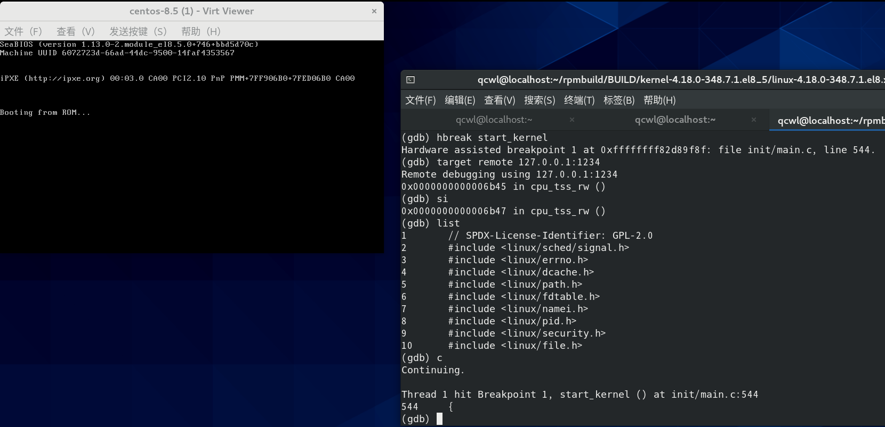

# 第 3 周

## 内核开发环境配置

5 月 11 日高承博导师在会议中指导我们在 QEMU 中编译内核并使用 gdb 调试。他使用的是 ARM64 台式机在裸机上跑 Linux，直接在 QEMU 里编译内核。但由于团队原因，我们无法统一在裸机上跑一样的 linux 发行版，因此仍然在 VMware 下操作，在 VMware 里安装 QEMU。我也不希望在 QEMU 里编译内核，于是花了不小的功夫搭建环境，根据我个人的实际过程整理如下。

### VMware 嵌套虚拟化

[VMware 开启嵌套虚拟化](https://linuxhint.com/kvm_qemu_centos8_install)：虚拟机设置 - 处理器 里勾选上尽可能多的虚拟化引擎。

检查`cat /proc/cpuinfo | grep vmx`（AMD CPU 换成 smx）是否输出正常，之后按照 [Arch Wiki](https://wiki.archlinux.org/title/KVM_(%E7%AE%80%E4%BD%93%E4%B8%AD%E6%96%87))：
```shell
sudo modprobe -r kvm_intel
sudo modprobe kvm_intel nested=1
```
此时，systool -m kvm_intel -v | grep nested 输出 `nested = "1"`。

为了持久化（不用每次开机都输入），[参考这里](https://www.cnblogs.com/jpinsz/p/12345982.html)：
`echo "options kvm-intel nested=1" | sudo tee /etc/modprobe.d/kvm-intel.conf`

### 配置虚拟机

参考[Arch Wiki](https://wiki.archlinux.org/title/Libvirt)：

安装 libvirt，然后
```shell
sudo systemctl start libvirtd
sudo systemctl enable libvirtd
```
此时 virsh version 能输出版本号。

安装 virt-install，virt-viewer

创建池：

`virsh pool-define-as 存储池名 dir - - - - 存储池路径`

构建池：

`virsh pool-build 存储池名`

启动池：

`virsh pool-start 存储池名`

自动启动池：

`virsh pool-autostart 存储池名`

创建域（centos-8.5 是虚拟机名字，memory 内存 MB、vcpus 虚拟 CPU 数、disk 最大磁盘 GB 根据情况选择）：
```shell
virt-install  \
  --name centos-8.5 \
  --memory 2048             \
  --vcpus=4      \
  --cpu host                \
  --cdrom /path/to/your/iso \
  --disk size=8,format=qcow2  \
  --network user            \
  --virt-type kvm
```
以后使用 virsh start centos-8.5 开启虚拟机后，使用 `virt-viewer --connect qemu:///session centos-8.5 --attach` 命令即可启动 virt-viewer，获得图形界面连接。


### 获取 CentOS 内核源码

如果使用 openEuler 4.19 内核源代码，此节可以跳过。以下的命令有的需要 sudo，请自行添加。

如果希望用编译的内核引导 CentOS 启动，我建议采用 CentOS 的内核源代码。

CentOS 8.5.2111 内核源代码获取：[参考 CentOS Wiki](https://wiki.centos.org/HowTos/I_need_the_Kernel_Source，https://blog.csdn.net/KamRoseLee/article/details/80147749)
```shell
dnf install mock
useradd -s /sbin/nologin mockbuild
rpm -ivh https://mirrors.aliyun.com/centos-vault/8.5.2111/BaseOS/Source/SPackages/k
ernel-4.18.0-348.7.1.el8_5.src.rpm
cd ~/rpmbuild/SPECS
rpmbuild -bp --target=$(uname -m) kernel.spec
```
如果提示有依赖缺失，在 dnf / yum 中安装即可；如果软件仓库找不到，需要到 EPEL（[参考 Fedora Wiki](https://fedoraproject.org/wiki/EPEL/zh-cn)）中寻找，执行：
```shell
sudo yum install https://dl.fedoraproject.org/pub/epel/epel-release-latest-8.noarch.rpm
sudo dnf config-manager --set-enabled powertools
```
之后再用 dnf / yum 安装即可。

执行成功后，内核源代码将会出现在 ~/rpmbuild/BUILD/kernel*/linux* 中。

### 编译内核源代码

当前正运行的 Linux 的内核编译选项就是 /boot/config-$(uname -r) 对应的文件，把它复制到源代码目录下（和 Makefile 同级）改名为 .config。

执行 `make menuconfig`，找到 `Processor type and features`，进入，找到 `Randomize the address of the kernel image (KASLR)`，关闭；返回到最顶层一级，进入`Kernel hacking`，确保勾选 `Kernel debugging`，进入 `Compile-time checks and compiler options`，确保勾选了 `Compile the kernel with debug info`，确保不勾选 `Reduce debugging information`，勾选 `Provide GDB scripts for kernel debugging`，保存。

如果使用的 .config 文件和内核不完全对应（eg. 编译 openEuler），那么可能会询问用户在 .config 中没有得到回答的选项，按默认即可。

[参考这里](https://blog.csdn.net/weixin_39871788/article/details/120313821)手动编辑 .config（我没找到在 menuconfig 的哪）把 `CONFIG_STRICT_KERNEL_RWX` 和 `CONFIG_STRICT_MODULE_RWX` 都改成 n，再[参考](https://linux.cn/thread-16243-1-1.html)着修改 arch/x86/Kconfig，把 `ARCH_HAS_STRICT_KERNEL_RWX` 和 `ARCH_HAS_STRICT_MODULE_RWX` 那两行注释掉。（难道我们的平台不支持硬件加断点，需要在调试时改写内核代码段来插入断点，因此要把写保护给关闭？）

此后，需要修改 Makefile，为了方便单步调试，要调低编译器优化等级，把文件中的 O2 改为 O1；此外，还要想办法关掉 Werror，这会在编译时启用严格的检查，把 Warning 均视为 Error，否则会编译不通过。需要想办法关掉，例如：
```Makefile
KBUILD_CFLAGS   := -Wall -Wundef -Wstrict-prototypes -Wno-trigraphs \
		   -fno-strict-aliasing -fno-common -fshort-wchar \
		   -Werror-implicit-function-declaration \
		   -Wno-format-security \
		   -std=gnu89
```
直接删去 `-Werror-implicit-function-declaration \`；对于
```Makefile
ifneq ($(DISABLE_WERROR),1)
ifneq ($(WITH_GCOV),1)
ifeq ($(KBUILD_EXTMOD),)
ifneq (,$(filter $(ARCH), x86 x86_64 powerpc s390))
#KBUILD_CFLAGS   += -Werror
endif
```
则注释掉。

用 `make -jN` 开始编译（N 的数目可以与当前环境下的 CPU 线程数一致。如果 GNOME 卡死后自动重启了，可以线程开小一点），编译耗时、内存均较大，完整编译的话可能需要提前预留好 10GB 以上磁盘空间。（这里我实际使用的是 `make localmodconfig`）

编译过程中，可能要[解决openssl 报错](https://blog.csdn.net/shakeme/article/details/80911441)、[certs/rhel.pem 报错](https://blog.csdn.net/u010356768/article/details/105805483)，解决后继续编译即可，此时 make 会接着编译，而不是从头开始。


### 调试内核

新建 /home/用户名/.gdbinit，添加 `add-auto-load-safe-path 你的源代码路径/scripts/gdb/vmlinux-gdb.py`。

为了用 gdb 调试 libvirt 管理的 QEMU 虚拟机，[需要](https://wiki.libvirt.org/page/QEMUSwitchToLibvirt#-boot)：
- 执行 virsh edit centos-8.5
- 第一行修改为`<domain type='kvm' xmlns:qemu='http://libvirt.org/schemas/domain/qemu/1.0'>`
- 下面加上
```xml
  <qemu:commandline>
    <qemu:arg value='-s'/>
  </qemu:commandline>
```
[-s 默认启用的端口是 1234](https://www.apriorit.com/dev-blog/597-debug-linux-kernel-qemu-libvirt)，不要添加 -S，那停不下来的（原因见本文最后）。
- 之后在 `<os>` 里添加 `<kernel>主机上编译内核中arch/arm/x86_64/boot/bzImage所在路径</kernel>`
- 保存退出。

之后开始调试内核：
- 先启动 virt-viewer，做好准备；
- 再在编译过的源代码目录下运行 gdb vmlinux，等 gdb 读取完毕后输入`hbreak start_kernel`，在 start_kernel 函数处断点；输入 `target remote 127.0.0.1:1234`，连接到虚拟机。
- 用 virsh 启动虚拟机，此时虚拟机会停在 start_kernel 函数前，之后在 gdb 里使用 break 就可以添加断点了，如 `break vt_console_print` 可以在终端输出前触发断点。


经我的反复测试，如果先启动 gdb 后启动虚拟机，必须用 hbreak （硬件辅助断点）触发一次断点才能触发 break 添加的端点（参考[这个讨论](https://www.zhihu.com/question/270476360)，可能是 bug）。
