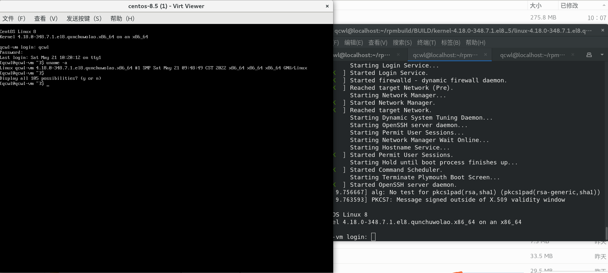
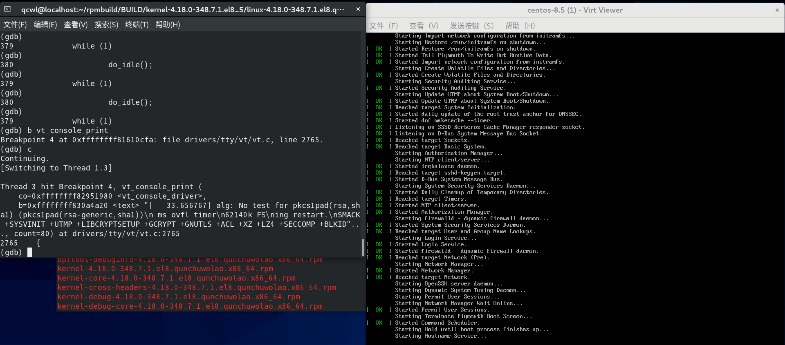

# 第 3 周

## kernel 学习

5 月 13 日，郭老师与我们进行了讲解。

### 内核态与用户态交互

- 系统调用
- ioctl
- procfs
- sysfs
- netlink

### 并发控制

- 屏蔽中断：`local_irq_disable`
- 开中断：`local_irq_enable`
这两个好像不是函数，而是宏？这是否会给我们带来麻烦？
- 禁止底半部：`local_bh_disable`
- 使能底半部：`local_bh_enable`
通常与自旋锁联合使用；只能禁止本 CPU 的中断
- 自旋锁定义：
```c
typedef struct spinlock {
	union {
		struct raw_spinlock rlock;

#ifdef CONFIG_DEBUG_LOCK_ALLOC
# define LOCK_PADSIZE (offsetof(struct raw_spinlock, dep_map))
		struct {
			u8 __padding[LOCK_PADSIZE];
			struct lockdep_map dep_map;
		};
#endif
	};
} spinlock_t;
```
- 自旋锁初始化：
```c
#define spin_lock_init(_lock)				\
do {							\
	spinlock_check(_lock);				\
	raw_spin_lock_init(&(_lock)->rlock);		\
} while (0)
```
这里的 do ... while (0) 是为了防止宏展开后 if 分支内出现多语句而编译失败；传入的是指针。
- 获取自旋锁：
```c
static __always_inline void spin_lock(spinlock_t *lock)
{
	raw_spin_lock(&lock->rlock);
}
```
```c
static __always_inline int spin_trylock(spinlock_t *lock)
{
	return raw_spin_trylock(&lock->rlock);
}
```
`spin_trylock` 在锁被占用的情况下直接返回 0。
- 释放自旋锁：
```c
static __always_inline void spin_unlock(spinlock_t *lock)
{
	raw_spin_unlock(&lock->rlock);
}
```

## 决策与失误

会后作出安排，叶景熙同学先着手研究 procfs 相关的要求，我则完成驱动调试环境的搭建。虽然我没花很多时间就实现了[单步调试内核](0511.md#内核开发环境配置)，但那毕竟只有内核本体，内核无法找到 init 程序会立即崩溃。对此，网上的解决方案有用 busybox 自制一个简单的 ram fs、自己制作 initramfs 等，但由于一开始高老师让我们在 QEMU 里编译，这样 `make install` 后自然还能继续跑 CentOS，再加上我以为这样能方便一点我们的调试，决定用自编译的内核引导启动 CentOS。殊不知，我把自己拖入了深深的泥淖中。

## 自编译内核引导 CentOS 启动

### 使用我编译的内核

在继续前，确保您的机器运行的是 Intel CPU，没有使用 Xen 或 Hyper-V；这是因为 AMD、Xen、Hyper-V 相关的编译选项有大半被我关闭了。如果不满足，麻烦您看[下一节](#手动编译)。
为了不干扰项目，我将打好的 RPM 包[单独放出](https://cloud.189.cn/web/share?code=3YjiUnBZJ73m)，（访问码：6ix3）这是因为现有的 GitHub 等对过大的文件似乎缺乏良好的支持。

如果你调整过 QEMU 的启动选项，请调整回去（eg. 取消 `<kernel>主机上编译内核中arch/arm/x86_64/boot/bzImage所在路径</kernel>` 使得启动时加载发行版的内核），直至你能开启 QEMU 进入 CentOS 为止。

接下来把文件上传到虚拟机中。这可以用 [Samba](0508.md#samba)，不过我采用的是更加简陋的方法：直接挂载虚拟机镜像，这要求你对 Linux 文件系统有一定了解，如果你 QEMU 里配置好了 Samba 就大可不必了：

[先把虚拟机镜像映射到 NFS](https://www.jianshu.com/p/6b977c02bfb2)：
```shell
sudo modprobe nbd max_part=8 # "max_part=N" 选项指定我们想要通过 nbd 管理的分区的最大个数
sudo qemu-nbd --connect=/dev/nbd0 ~/.local/share/libvirt/images/你的虚拟机磁盘镜像.qcow2
```

接下来我们要挂载 /home 所在的分区（当然理论上你挂载除了 swap 外的哪个都行，只要空间够），我们希望往这里面复制 RPM 包，如果没有单独给它分区的话就是 cl-root。用 `sudo fdisk /dev/nbd0 -l` 检查其分区表，如果要挂载的分区类型为 Linux LVM 的逻辑卷（这通常是除了 /boot 分区之外的），那么执行：`sudo lvscan`，如果输出信息告诉你，两个 VG 重名（Duplicate VG name），[那么](https://www.warningrc.com/2016/05/06/linux-mount-lvm-duplicate-vg.html)通过 `vgdisplay` 查看 lvm 的 VG UUID，执行 `sudo vgrename 虚拟机磁盘VG的UUID 一个新名字`（我感觉新名字最好不带-符号）来改名，这样就可以继续执行下面的步骤了。

如果 `sudo lvscan` 输出中[有未被激活（INACTIVE）的](https://www.cnblogs.com/achengmu/p/4374397.html)，执行 `sudo vgchange -ay 要激活的设备在/dev下的节点`来激活。之后，

```shell
sudo mkdir /mnt/挂载点名称，例如 myqemu
sudo mount /dev/要挂载的磁盘设备 /mnt/挂载点
```

此后用挂载点即可访问挂载的分区。我们把下载的 RPM 包中文件名不带 debuginfo 的全部复制进 /home 下某个你认为合适的文件夹中。复制完后，用：
```shell
sudo umount /mnt/挂载点
```
卸载。

如果你在前面修改了 VG 名，由于虚拟机写死了这一值，改变 VG 名后虚拟机会找不到指定的磁盘分区而无法开机，因此需要我们同步地[改变虚拟机的 GRUB 引导和分区表](https://www.cnblogs.com/xiaoqi-home/p/11235129.html)：

挂载 boot 分区（如果你不知道哪个是它，那么一般地，/boot 分得比 /root 小得多）；

修改 boot 分区 grub2 目录下的 grubenv 与 grub.cfg；修改 etc 所在分区下 default 目录下的 grub 文件和 etc 所在分区下的 fstab 文件，要求如下：
- 假设原来是 VG 名是 cl，改后的名是 vg_qemu，则把 cl-root，cl-swap 等都改成 vg_qemu-root，vg_qemu-swap；如果还有单独出现的 cl，也改成 vg_qemu。

修改完后，卸载 boot 分区。

当所有对虚拟机磁盘的修改工作都完成后，执行
```shell
vgchange -an /dev/要取消激活的节点（如果上面有用 LVM 的话）
sudo qemu-nbd --disconnect /dev/nbd0
```
断开连接，之后启动虚拟机。

进入虚拟机后，终端进入你复制 RPM 包的路径，执行 `sudo yum localinstall kernel*.rpm` 安装（如果已经安装过同名的软件包，先卸载旧的），下次重启虚拟机后，开机时 GRUB 启动引导就会多出 qunchuwolao 的引导项，用方向键移动，按 Enter 启动，不出意外的话可以进入系统了。



成功进入系统还不够，为了能够使用 GDB 调试，主机也需要把 kernel-debuginfo-4.18.0... 与 kernel-debuginfo-common-x86_64-4.18.0... 这两个 RPM 包安装。之后，编辑 `~/.gdbinit`，添加 `add-auto-load-safe-path 你放置的scripts/gdb/vmlinux-gdb.py`。此后，重新打开终端命令行使之生效，执行 `gdb 你放置的vmlinux` 即可[调试](0511.md#调试内核)，但这次由于内核是装在虚拟机里面的，不要添加 `<kernel>` 了。（也可以用 `attach` 命令）



如果你的内核报出 CPU 有关的错误（`host doesn't support requested feature: MSR(48**)`），尝试改 CPU Passthrough。

### CPU Passthrough

[参考这里](https://forums.gentoo.org/viewtopic-t-1118670-start-0.html)，用 `virsh edit` 把 cpu mode 改成'host-passthrough'。

### 输出到 console

参考自[这里](http://freemandealer.github.io/2015/10/04/debug-kernel-with-qemu-2/)，在 QEMU `/etc/default/grub` 中 `GRUB_CMDLINE_LINUX` 里去掉 `quiet`，加入 `console=tty0 console=ttyS0,115200`，之后执行 `sudo grub2-mkconfig -o /boot/grub2/grub.cfg`，重启后用 `virsh console 虚拟机名` 即可在本地终端上查看输出，方便调试。

### 手动编译

这里，我把最终的步骤呈现出来，把探索的过程放在后面。事实上最重要的参考文章是[CentOS wiki](https://wiki.centos.org/zh/HowTos/Custom_Kernel)。

- 源代码准备：按照[这里的记录](0511.md#获取-centos-内核源码)准备好源代码。之后，配置编译选项。需要[参考 kvm_guest.config](https://github.com/torvalds/linux/blob/master/kernel/configs/kvm_guest.config) 等，可自行上 Github 搜索借鉴在 QEMU 上跑内核所需的编译选项。接着复制配置文件到 rpmbuild/SOURCES 中，我为了方便，直接`cp .config configs/kernel-4.18.0-x86_64.config kernel-4.18.0-x86_64-debug.config`。

- 升级 make：自己编译安装 GNU Make 4.3，（因为 [4.2.1 有个 Bug](https://bugs.centos.org/view.php?id=18432)）

- 接着[修改 Makefile、Kconfig](0511.md#编译内核源代码)，但在修改前请用 git 记录一下，修改后用 git diff 生成 patch，并把 patch 放到 rpmbuild/SOURCES 文件夹中；

- 修改 rpmbuild/SPECS/kernel.spec：修改 `# define buildid .local` 为 `%define buildid .你的名字`，在 `Patch999999: linux-kernel-test.patch` 上面加入 `Patch40000: 你的patch文件名字.patch`，在 `ApplyOptionalPatch linux-kernel-test.patch` 后面加入 `ApplyOptionalPatch 你的patch文件名字.patch`。以后任何代码修改都用 patch 的形式。

- 编译：进入 ~/rpmbuild/SPECS，执行
```shell
rpmbuild -bb --target=`uname -m` --without debug --without kabichk --with baseonly kernel.spec 2> build-err.log | tee build-out.log
```
需要注意的是，以上这条指令每次都会删除整个目录、解压缩源代码、从头编译，不仅会清空上次编译的中间文件，还会清空你对代码所做的修改。要想把修改保存下来，只能打成 patch 的形式。

如果报错 `arch/x86/entry/entry_64.S:1054: undefined reference to 'do_vmm_communication'`，可能需要把 `CONFIG_AMD_MEM_ENCRYPT` 打开。


### 探索曲折

#### busybox 方案

安装 glibc-static，[参考这里](https://www.cnblogs.com/dongxb/p/16192358.html) 使用 busybox：
```
wget https://busybox.net/downloads/busybox-1.35.0.tar.bz2
 tar -xvf busybox-1.32.1.tar.bz2
cd busybox-1.32.1/
make menuconfig
```
最后能进 busybox，但我想跑 CentOS。

#### dracut 方案

Dracut 使用参考 [openSUSE Wiki](https://zh.opensuse.org/SDB:Dracut)。


看[这个](http://www.linuxcoming.com/index.php/archives/29/) 后执行`dracut --force --fstab --early-microcode --kmoddir /lib/modules/${KERNEL_VERSION} --kver=${KERNEL_VERSION}`，还是进不去。
这是某次尝试的输出，后来发现其实内核模块是和内核不对应的。


```
[    1.849164] systemd[1]: Running in initial RAM disk.

Welcome to CentOS Linux 8 dracut-049-191.git20210920.el8 (Initramfs)!

[    1.866408] systemd[1]: Set hostname to <localhost.localdomain>.
[    1.884334] usb 1-1: New USB device found, idVendor=0627, idProduct=0001, bcdDevice= 0.00
[    1.889004] usb 1-1: New USB device strings: Mfr=1, Product=3, SerialNumber=10
[    1.891738] usb 1-1: Product: QEMU USB Tablet
[    1.893691] usb 1-1: Manufacturer: QEMU
[    1.895162] usb 1-1: SerialNumber: 42
[    1.900484] input: QEMU QEMU USB Tablet as /devices/pci0000:00/0000:00:05.7/usb1/1-1/1-1:1.0/0003:0627:0001.0001/input/input4
[    1.905428] hid-generic 0003:0627:0001.0001: input,hidraw0: USB HID v0.01 Mouse [QEMU QEMU USB Tablet] on usb-0000:00:05.7-1/input0
[    1.930058] systemd[1]: Reached target Slices.
[  OK  ] Reached target Slices.
[    1.935236] systemd[1]: Reached target Local File Systems.
[  OK  ] Reached target Local File Systems.
[    1.941827] systemd[1]: Reached target Timers.
[  OK  ] Reached target Timers.
[    1.947329] systemd[1]: Listening on Journal Socket (/dev/log).
[  OK  ] Listening on Journal Socket (/dev/log).
[    1.954093] systemd[1]: Listening on Journal Socket.
[  OK  ] Listening on Journal Socket.
         Starting Create Volatile Files and Directories...
         Starting Journal Service...
         Starting Setup Virtual Console...
[  OK  ] Started Memstrack Anylazing Service.
         Starting Create list of required st…ce nodes for the current kernel...
[  OK  ] Listening on udev Control Socket.
[  OK  ] Reached target Swap.
[  OK  ] Listening on udev Kernel Socket.
[  OK  ] Reached target Sockets.
         Starting Apply Kernel Variables...
[  OK  ] Started Journal Service.
[  OK  ] Started Create Volatile Files and Directories.
[  OK  ] Started Create list of required sta…vice nodes for the current kernel.
[  OK  ] Started Apply Kernel Variables.
         Starting Create Static Device Nodes in /dev...
[  OK  ] Started Create Static Device Nodes in /dev.
[    2.467088] input: ImExPS/2 Generic Explorer Mouse as /devices/platform/i8042/serio1/input/input3

[  OK  ] Started Setup Virtual Console.
         Starting dracut cmdline hook...
[  OK  ] Started dracut cmdline hook.
         Starting dracut pre-udev hook...
[    2.631160] dm_mod: disagrees about version of symbol module_layout
[    2.634331] dracut-pre-udev[406]: modprobe: ERROR: could not insert 'dm_mod': Exec format error
[    2.644248] dm_mod: disagrees about version of symbol module_layout
[  OK  ] Started dracut pre-udev hook.
         Starting udev Kernel Device Manager...
[  OK  ] Started udev Kernel Device Manager.
         Starting udev Coldplug all Devices...
         Mounting Kernel Configuration File System...
[  OK  ] Mounted Kernel Configuration File System.
[  OK  ] Started udev Coldplug all Devices.
         Starting dracut initqueue hook...
[  OK  [    2.796387] virtio_console: disagrees about version of symbol module_layout
] Reached target System Initialization.
         [    2.810782] serio_raw: disagrees about version of symbol module_layout
[    2.810940] serio_raw: disagrees about version of symbol module_layout
Starting Show Plymouth Boot Screen...[    2.819930] virtio_scsi: disagrees about version of symbol module_layout
[    2.823976] e1000: disagrees about version of symbol module_layout
[    2.824447] crc32c_intel: disagrees about version of symbol module_layout
[    2.824521] crc32c_intel: disagrees about version of symbol module_layout
[    2.845338] crc32c_intel: disagrees about version of symbol module_layout

[    2.850689] libata: disagrees about version of symbol module_layout
[    2.858075] libata: disagrees about version of symbol module_layout
[    2.865456] libata: disagrees about version of symbol module_layout
[    2.866916] drm: disagrees about version of symbol module_layout
[    2.872494] crc32c_intel: disagrees about version of symbol module_layout
[  OK  ] Started Show Plymouth Boot Screen.
[  OK  ] Reached target Paths.
[  OK  ] Started Forward Password Requests to Plymouth Directory Watch.
[  OK  ] Reached target Basic System.
[  132.695129] dracut-initqueue[465]: Warning: dracut-initqueue timeout - starting timeout scripts
[  133.245994] dracut-initqueue[465]: Warning: dracut-initqueue timeout - starting timeout scripts
[  133.783312] dracut-initqueue[465]: Warning: dracut-initqueue timeout - starting timeout scripts
[  134.324503] dracut-initqueue[465]: Warning: dracut-initqueue timeout - starting timeout scripts
[  134.862973] dracut-initqueue[465]: Warning: dracut-initqueue timeout - starting timeout scripts
[  135.402772] dracut-initqueue[465]: Warning: dracut-initqueue timeout - starting timeout scripts
[  135.941217] dracut-initqueue[465]: Warning: dracut-initqueue timeout - starting timeout scripts
[  136.478489] dracut-initqueue[465]: Warning: dracut-initqueue timeout - starting timeout scripts
[  137.016279] dracut-initqueue[465]: Warning: dracut-initqueue timeout - starting timeout scripts
[  137.557078] dracut-initqueue[465]: Warning: dracut-initqueue timeout - starting timeout scripts
[  138.095766] dracut-initqueue[465]: Warning: dracut-initqueue timeout - starting timeout scripts
[  138.636748] dracut-initqueue[465]: Warning: dracut-initqueue timeout - starting timeout scripts
[  139.175856] dracut-initqueue[465]: Warning: dracut-initqueue timeout - starting timeout scripts
[  139.713505] dracut-initqueue[465]: Warning: dracut-initqueue timeout - starting timeout scripts
[  140.251236] dracut-initqueue[465]: Warning: dracut-initqueue timeout - starting timeout scripts
[  140.786674] dracut-initqueue[465]: Warning: dracut-initqueue timeout - starting timeout scripts
[  141.328152] dracut-initqueue[465]: Warning: dracut-initqueue timeout - starting timeout scripts
[  141.863842] dracut-initqueue[465]: Warning: dracut-initqueue timeout - starting timeout scripts
[  142.402733] dracut-initqueue[465]: Warning: dracut-initqueue timeout - starting timeout scripts
[  142.940472] dracut-initqueue[465]: Warning: dracut-initqueue timeout - starting timeout scripts
[  143.478327] dracut-initqueue[465]: Warning: dracut-initqueue timeout - starting timeout scripts
[  144.017670] dracut-initqueue[465]: Warning: dracut-initqueue timeout - starting timeout scripts
[  144.556859] dracut-initqueue[465]: Warning: dracut-initqueue timeout - starting timeout scripts
[  145.096057] dracut-initqueue[465]: Warning: dracut-initqueue timeout - starting timeout scripts
[  145.634311] dracut-initqueue[465]: Warning: dracut-initqueue timeout - starting timeout scripts
[  146.167534] dracut-initqueue[465]: Warning: dracut-initqueue timeout - starting timeout scripts
[  146.703937] dracut-initqueue[465]: Warning: dracut-initqueue timeout - starting timeout scripts
[  147.244802] dracut-initqueue[465]: Warning: dracut-initqueue timeout - starting timeout scripts
[  147.781944] dracut-initqueue[465]: Warning: dracut-initqueue timeout - starting timeout scripts
[  148.320361] dracut-initqueue[465]: Warning: dracut-initqueue timeout - starting timeout scripts
[  148.858553] dracut-initqueue[465]: Warning: dracut-initqueue timeout - starting timeout scripts
[  149.396918] dracut-initqueue[465]: Warning: dracut-initqueue timeout - starting timeout scripts
[  149.929655] dracut-initqueue[465]: Warning: dracut-initqueue timeout - starting timeout scripts
[  150.467537] dracut-initqueue[465]: Warning: dracut-initqueue timeout - starting timeout scripts
[  150.997244] dracut-initqueue[465]: Warning: dracut-initqueue timeout - starting timeout scripts
[  151.529141] dracut-initqueue[465]: Warning: dracut-initqueue timeout - starting timeout scripts
[  152.065974] dracut-initqueue[465]: Warning: dracut-initqueue timeout - starting timeout scripts
[  152.597371] dracut-initqueue[465]: Warning: dracut-initqueue timeout - starting timeout scripts
[  153.128221] dracut-initqueue[465]: Warning: dracut-initqueue timeout - starting timeout scripts
[  153.659858] dracut-initqueue[465]: Warning: dracut-initqueue timeout - starting timeout scripts
[  154.191585] dracut-initqueue[465]: Warning: dracut-initqueue timeout - starting timeout scripts
[  154.727088] dracut-initqueue[465]: Warning: dracut-initqueue timeout - starting timeout scripts
[  155.258775] dracut-initqueue[465]: Warning: dracut-initqueue timeout - starting timeout scripts
[  155.787760] dracut-initqueue[465]: Warning: dracut-initqueue timeout - starting timeout scripts
[  156.321596] dracut-initqueue[465]: Warning: dracut-initqueue timeout - starting timeout scripts
[  156.854160] dracut-initqueue[465]: Warning: dracut-initqueue timeout - starting timeout scripts
[  157.387598] dracut-initqueue[465]: Warning: dracut-initqueue timeout - starting timeout scripts
[  157.921762] dracut-initqueue[465]: Warning: dracut-initqueue timeout - starting timeout scripts
[  158.454222] dracut-initqueue[465]: Warning: dracut-initqueue timeout - starting timeout scripts
[  158.992096] dracut-initqueue[465]: Warning: dracut-initqueue timeout - starting timeout scripts
[  159.533888] dracut-initqueue[465]: Warning: dracut-initqueue timeout - starting timeout scripts
[  160.067846] dracut-initqueue[465]: Warning: dracut-initqueue timeout - starting timeout scripts
[  160.615590] dracut-initqueue[465]: Warning: dracut-initqueue timeout - starting timeout scripts
[  161.149453] dracut-initqueue[465]: Warning: dracut-initqueue timeout - starting timeout scripts
[  161.684643] dracut-initqueue[465]: Warning: dracut-initqueue timeout - starting timeout scripts
[  162.219237] dracut-initqueue[465]: Warning: dracut-initqueue timeout - starting timeout scripts
[  162.759100] dracut-initqueue[465]: Warning: dracut-initqueue timeout - starting timeout scripts
[  163.297007] dracut-initqueue[465]: Warning: dracut-initqueue timeout - starting timeout scripts
[  163.834983] dracut-initqueue[465]: Warning: dracut-initqueue timeout - starting timeout scripts
[  164.375511] dracut-initqueue[465]: Warning: dracut-initqueue timeout - starting timeout scripts
[  164.912237] dracut-initqueue[465]: Warning: dracut-initqueue timeout - starting timeout scripts
[  165.446602] dracut-initqueue[465]: Warning: dracut-initqueue timeout - starting timeout scripts
[  165.983340] dracut-initqueue[465]: Warning: dracut-initqueue timeout - starting timeout scripts
[  166.518725] dracut-initqueue[465]: Warning: dracut-initqueue timeout - starting timeout scripts
[  167.056873] dracut-initqueue[465]: Warning: dracut-initqueue timeout - starting timeout scripts
[  167.592541] dracut-initqueue[465]: Warning: dracut-initqueue timeout - starting timeout scripts
[  168.139171] dracut-initqueue[465]: Warning: dracut-initqueue timeout - starting timeout scripts
[  168.681791] dracut-initqueue[465]: Warning: dracut-initqueue timeout - starting timeout scripts
[  169.216176] dracut-initqueue[465]: Warning: dracut-initqueue timeout - starting timeout scripts
[  169.750415] dracut-initqueue[465]: Warning: dracut-initqueue timeout - starting timeout scripts
[  170.289122] dracut-initqueue[465]: Warning: dracut-initqueue timeout - starting timeout scripts
[  170.825519] dracut-initqueue[465]: Warning: dracut-initqueue timeout - starting timeout scripts
[  171.363578] dracut-initqueue[465]: Warning: dracut-initqueue timeout - starting timeout scripts
[  171.905669] dracut-initqueue[465]: Warning: dracut-initqueue timeout - starting timeout scripts
[  172.440902] dracut-initqueue[465]: Warning: dracut-initqueue timeout - starting timeout scripts
[  172.976881] dracut-initqueue[465]: Warning: dracut-initqueue timeout - starting timeout scripts
[  173.511014] dracut-initqueue[465]: Warning: dracut-initqueue timeout - starting timeout scripts
[  174.046507] dracut-initqueue[465]: Warning: dracut-initqueue timeout - starting timeout scripts
[  174.578303] dracut-initqueue[465]: Warning: dracut-initqueue timeout - starting timeout scripts
[  175.107678] dracut-initqueue[465]: Warning: dracut-initqueue timeout - starting timeout scripts
[  175.643492] dracut-initqueue[465]: Warning: dracut-initqueue timeout - starting timeout scripts
[  176.179449] dracut-initqueue[465]: Warning: dracut-initqueue timeout - starting timeout scripts
[  176.719622] dracut-initqueue[465]: Warning: dracut-initqueue timeout - starting timeout scripts
[  177.255204] dracut-initqueue[465]: Warning: dracut-initqueue timeout - starting timeout scripts
[  177.788932] dracut-initqueue[465]: Warning: dracut-initqueue timeout - starting timeout scripts
[  178.324111] dracut-initqueue[465]: Warning: dracut-initqueue timeout - starting timeout scripts
[  178.859107] dracut-initqueue[465]: Warning: dracut-initqueue timeout - starting timeout scripts
[  179.395495] dracut-initqueue[465]: Warning: dracut-initqueue timeout - starting timeout scripts
[  179.937266] dracut-initqueue[465]: Warning: dracut-initqueue timeout - starting timeout scripts
[  180.477663] dracut-initqueue[465]: Warning: dracut-initqueue timeout - starting timeout scripts
[  181.014921] dracut-initqueue[465]: Warning: dracut-initqueue timeout - starting timeout scripts
[  181.555335] dracut-initqueue[465]: Warning: dracut-initqueue timeout - starting timeout scripts
[  182.097637] dracut-initqueue[465]: Warning: dracut-initqueue timeout - starting timeout scripts
[  182.637469] dracut-initqueue[465]: Warning: dracut-initqueue timeout - starting timeout scripts
[  183.177110] dracut-initqueue[465]: Warning: dracut-initqueue timeout - starting timeout scripts
[  183.711741] dracut-initqueue[465]: Warning: dracut-initqueue timeout - starting timeout scripts
[  184.248981] dracut-initqueue[465]: Warning: dracut-initqueue timeout - starting timeout scripts
[  184.786378] dracut-initqueue[465]: Warning: dracut-initqueue timeout - starting timeout scripts
[  185.327901] dracut-initqueue[465]: Warning: dracut-initqueue timeout - starting timeout scripts
[  185.863572] dracut-initqueue[465]: Warning: dracut-initqueue timeout - starting timeout scripts
[  186.405231] dracut-initqueue[465]: Warning: dracut-initqueue timeout - starting timeout scripts
[  186.947654] dracut-initqueue[465]: Warning: dracut-initqueue timeout - starting timeout scripts
[  187.486335] dracut-initqueue[465]: Warning: dracut-initqueue timeout - starting timeout scripts
[  188.024612] dracut-initqueue[465]: Warning: dracut-initqueue timeout - starting timeout scripts
[  188.567283] dracut-initqueue[465]: Warning: dracut-initqueue timeout - starting timeout scripts
[  189.106285] dracut-initqueue[465]: Warning: dracut-initqueue timeout - starting timeout scripts
[  189.645583] dracut-initqueue[465]: Warning: dracut-initqueue timeout - starting timeout scripts
[  190.188443] dracut-initqueue[465]: Warning: dracut-initqueue timeout - starting timeout scripts
[  190.729246] dracut-initqueue[465]: Warning: dracut-initqueue timeout - starting timeout scripts
[  191.264069] dracut-initqueue[465]: Warning: dracut-initqueue timeout - starting timeout scripts
[  191.800760] dracut-initqueue[465]: Warning: dracut-initqueue timeout - starting timeout scripts
[  192.347342] dracut-initqueue[465]: Warning: dracut-initqueue timeout - starting timeout scripts
[  192.887047] dracut-initqueue[465]: Warning: dracut-initqueue timeout - starting timeout scripts
[  193.424334] dracut-initqueue[465]: Warning: dracut-initqueue timeout - starting timeout scripts
[  193.960285] dracut-initqueue[465]: Warning: dracut-initqueue timeout - starting timeout scripts
[  194.492594] dracut-initqueue[465]: Warning: dracut-initqueue timeout - starting timeout scripts
[  195.026316] dracut-initqueue[465]: Warning: dracut-initqueue timeout - starting timeout scripts
[  195.558742] dracut-initqueue[465]: Warning: dracut-initqueue timeout - starting timeout scripts
[  196.094988] dracut-initqueue[465]: Warning: dracut-initqueue timeout - starting timeout scripts
[  196.625423] dracut-initqueue[465]: Warning: dracut-initqueue timeout - starting timeout scripts
[  196.625513] dracut-initqueue[465]: Warning: Could not boot.
         Starting Setup Virtual Console...
[  OK  ] Started Setup Virtual Console.
         Starting Dracut Emergency Shell...
Warning: /dev/sda does not exist

Generating "/run/initramfs/rdsosreport.txt"
[  197.306728] dm_mod: disagrees about version of symbol module_layout


Entering emergency mode. Exit the shell to continue.
Type "journalctl" to view system logs.
You might want to save "/run/initramfs/rdsosreport.txt" to a USB stick or /boot
after mounting them and attach it to a bug report.


dracut:/# modprobe -f dm_mod
[  215.859653] dm_mod: module_layout: kernel tainted.
[  215.863050] Disabling lock debugging due to kernel taint
[  215.866266] dm_mod: module verification failed: signature and/or required key missing - tainting kernel
[  215.874356] kernel tried to execute NX-protected page - exploit attempt? (uid: 0)
[  215.876292] BUG: unable to handle kernel paging request at ffffffffa0076082
[  215.878399] PGD 2813067 P4D 2813067 PUD 2814063 PMD 100d69067 PTE 8000000106e5f163
[  215.881213] Oops: 0011 [#1] SMP NOPTI
[  215.883177] CPU: 0 PID: 5221 Comm: modprobe Tainted: GF           E    --------- -  - 4.18.0-348.7.1.el8_5.x86_64 #27
[  215.887727] Hardware name: Red Hat KVM, BIOS 1.13.0-2.module_el8.5.0+746+bbd5d70c 04/01/2014
[  215.891135] RIP: 0010:dm_init+0x0/0x4d [dm_mod]
[  215.892825] Code: ff e8 6c fc 08 e1 eb 16 83 3d f5 79 ff ff 00 75 14 89 05 ed 79 ff ff eb 0c bb f4 ff ff ff e8 45 c2 fd ff 89 dd 89 e8 5b 5d c3 <0f> 1f 44 00 00 41 54 55 53 31 db 48 8b 04 dd a0 62 07 a0 89 dd e8
[  215.900326] RSP: 0018:ffffc900065f3dc0 EFLAGS: 00010246
[  215.902227] RAX: 0000000000000000 RBX: 0000000000000000 RCX: 0000000000000000
[  215.904006] RDX: ffffffff828180e0 RSI: 0000000000000000 RDI: ffffffffa0076082
[  215.906703] RBP: ffffffffa0076082 R08: ffffc900065f3df0 R09: ffffffff812b9041
[  215.909201] R10: 0000000000000000 R11: ffffffff82a25740 R12: ffffc900065f3e88
[  215.912269] R13: 000055cb8f2a47d6 R14: ffffffffa006d6d8 R15: 0000000000000000
[  215.915415] FS:  00007f4ce33a6740(0000) GS:ffff88813bc00000(0000) knlGS:0000000000000000
[  215.918292] CS:  0010 DS: 0000 ES: 0000 CR0: 0000000080050033
[  215.921764] CR2: ffffffffa0076082 CR3: 0000000108d04004 CR4: 0000000000370ef0
[  215.924892] Call Trace:
[  215.926078]  do_one_initcall+0x85/0x1b3
[  215.928058]  ? do_init_module+0x22/0x22d
[  215.930245]  ? kmem_cache_alloc_trace+0x136/0x26b
[  215.932461]  do_init_module+0x5a/0x22d
[  215.934538]  load_module+0x402/0x407
[  215.935756]  __do_sys_init_module+0x9b/0xa4
[  215.937701]  __se_sys_init_module+0xa/0xb
[  215.939527]  __x64_sys_init_module+0x16/0x17
[  215.941703]  do_syscall_64+0x80/0x197
[  215.943180]  entry_SYSCALL_64_after_hwframe+0x65/0xca
[  215.945244] RIP: 0033:0x7f4ce237c80e
[  215.946788] Code: 48 8b 0d 7d 16 2c 00 f7 d8 64 89 01 48 83 c8 ff c3 66 2e 0f 1f 84 00 00 00 00 00 90 f3 0f 1e fa 49 89 ca b8 af 00 00 00 0f 05 <48> 3d 01 f0 ff ff 73 01 c3 48 8b 0d 4a 16 2c 00 f7 d8 64 89 01 48
[  215.952965] RSP: 002b:00007ffc47cceed8 EFLAGS: 00000246 ORIG_RAX: 00000000000000af
[  215.955681] RAX: ffffffffffffffda RBX: 000055cb91403bc0 RCX: 00007f4ce237c80e
[  215.958196] RDX: 000055cb8f2a47d6 RSI: 000000000004fd04 RDI: 000055cb9140b5a0
[  215.960648] RBP: 000055cb8f2a47d6 R08: 000000000004fd04 R09: 000055cb914046c0
[  215.962352] R10: 000000000000000e R11: 0000000000000246 R12: 000055cb9140b5a0
[  215.964869] R13: 000055cb91403a20 R14: 0000000000000000 R15: 0000000000000000
[  215.967314] Modules linked in: dm_mod(FE+)
[  215.968787] CR2: ffffffffa0076082
[  215.970118] ---[ end trace 5b2276622dcfadbe ]---
[  215.971791] RIP: 0010:dm_init+0x0/0x4d [dm_mod]
[  215.973443] Code: ff e8 6c fc 08 e1 eb 16 83 3d f5 79 ff ff 00 75 14 89 05 ed 79 ff ff eb 0c bb f4 ff ff ff e8 45 c2 fd ff 89 dd 89 e8 5b 5d c3 <0f> 1f 44 00 00 41 54 55 53 31 db 48 8b 04 dd a0 62 07 a0 89 dd e8
[  215.979517] RSP: 0018:ffffc900065f3dc0 EFLAGS: 00010246
[  215.980925] RAX: 0000000000000000 RBX: 0000000000000000 RCX: 0000000000000000
[  215.983249] RDX: ffffffff828180e0 RSI: 0000000000000000 RDI: ffffffffa0076082
[  215.986029] RBP: ffffffffa0076082 R08: ffffc900065f3df0 R09: ffffffff812b9041
[  215.988969] R10: 0000000000000000 R11: ffffffff82a25740 R12: ffffc900065f3e88
[  215.991299] R13: 000055cb8f2a47d6 R14: ffffffffa006d6d8 R15: 0000000000000000
[  215.993163] FS:  00007f4ce33a6740(0000) GS:ffff88813bc00000(0000) knlGS:0000000000000000
[  215.995970] CS:  0010 DS: 0000 ES: 0000 CR0: 0000000080050033
[  215.998013] CR2: ffffffffa0076082 CR3: 0000000108d04004 CR4: 0000000000370ef0
[  216.000614] Kernel panic - not syncing: Fatal exception
[  216.003394] Kernel Offset: disabled
[  216.004523] ---[ end Kernel panic - not syncing: Fatal exception ]---
```

#### 手动打包

CentOS 解包打包参考[https://www.jianshu.com/p/218544a3531b](这篇文章)。
执行
```shell
make modules
make modules_install INSTALL_MOD_PATH=/path/to/rootfs_cpio
```
还是没法进入系统。


#### 直接装进虚拟机里

挂载虚拟机镜像，
```shell
make modules
sudo make modules_install INSTALL_MOD_PATH=/mnt/qemu/
```
从 `dracut-pre-udev[406]: modprobe: FATAL: Module dm_mod not found in directory /lib/modules/4.18.0`，发现编译出内核的版本号似乎不完全一样，发现应该[设置localversion](https://blog.csdn.net/gatieme/article/details/78510497)：手动创建localversion，写入 `-348.7.1.el8_5.x86_64`，还是开不了机，输出什么我没有复制。

直接把 vmlinux 什么的复制进 /boot 分区，也不行。

[采用 `make -C $KDIR M=$PWD`](https://www.kernel.org/doc/html/latest/kbuild/modules.html)，执行不了。

5. 使用 RPM 构建

经历了种种失败后，我意识到内核、initramfs 和模块要以一种恰当的方式配置，这让我转向了 RPM 构建系统，我认为这样打出来的包应该是已经配置好的。在编译时遇到卡在 `cp python_ext_build/lib/perf*.so python/ ld -r -o pmu-events/pmu-events-in.o pmu-events/pmu-events.o`，经查，需要更新 make。
这应该是比较接近成功的输出，但为什么 kernel panic 呢？
```
[    0.000000] Linux version 4.18.0-348.7.1.el8.qunchuwolao.x86_64+debug (qcwl@localhost.localdomain) (gcc version 8.5.0 20210514 (Red Hat 8.5.0-4) (GCC)) #1 SMP Fri May 20 00:35:30 CST 2022
[    0.000000] Command line: BOOT_IMAGE=(hd0,msdos1)/vmlinuz-4.18.0-348.7.1.el8.qunchuwolao.x86_64+debug root=/dev/mapper/vg_qemu-root ro crashkernel=auto resume=/dev/mapper/vg_qemu-swap rd.lvm.lv=vg_qemu/root rd.lvm.lv=vg_qemu/swap rhgb nokaslr console=tty0 console=ttyS0,115200
[    0.000000] x86/fpu: Supporting XSAVE feature 0x001: 'x87 floating point registers'
[    0.000000] x86/fpu: Supporting XSAVE feature 0x002: 'SSE registers'
[    0.000000] x86/fpu: Supporting XSAVE feature 0x004: 'AVX registers'
[    0.000000] x86/fpu: xstate_offset[2]:  576, xstate_sizes[2]:  256
[    0.000000] x86/fpu: Enabled xstate features 0x7, context size is 832 bytes, using 'compacted' format.
[    0.000000] BIOS-provided physical RAM map:
[    0.000000] BIOS-e820: [mem 0x0000000000000000-0x000000000009fbff] usable
[    0.000000] BIOS-e820: [mem 0x000000000009fc00-0x000000000009ffff] reserved
[    0.000000] BIOS-e820: [mem 0x00000000000f0000-0x00000000000fffff] reserved
[    0.000000] BIOS-e820: [mem 0x0000000000100000-0x00000000bffdefff] usable
[    0.000000] BIOS-e820: [mem 0x00000000bffdf000-0x00000000bfffffff] reserved
[    0.000000] BIOS-e820: [mem 0x00000000feffc000-0x00000000feffffff] reserved
[    0.000000] BIOS-e820: [mem 0x00000000fffc0000-0x00000000ffffffff] reserved
[    0.000000] BIOS-e820: [mem 0x0000000100000000-0x000000013fffffff] usable
[    0.000000] NX (Execute Disable) protection: active
[    0.000000] SMBIOS 2.8 present.
[    0.000000] DMI: Red Hat KVM, BIOS 1.13.0-2.module_el8.5.0+746+bbd5d70c 04/01/2014
[    0.000000] Hypervisor detected: KVM
[    0.000000] kvm-clock: Using msrs 4b564d01 and 4b564d00
[    0.000000] kvm-clock: cpu 0, msr 3c01001, primary cpu clock
[    0.000000] kvm-clock: using sched offset of 161886116712 cycles
[    0.000000] clocksource: kvm-clock: mask: 0xffffffffffffffff max_cycles: 0x1cd42e4dffb, max_idle_ns: 881590591483 ns
[    0.000000] tsc: Detected 2904.004 MHz processor
[    0.000000] last_pfn = 0x140000 max_arch_pfn = 0x400000000
[    0.000000] x86/PAT: Configuration [0-7]: WB  WC  UC- UC  WB  WP  UC- WT  
[    0.000000] last_pfn = 0xbffdf max_arch_pfn = 0x400000000
[    0.000000] found SMP MP-table at [mem 0x000f5ba0-0x000f5baf]
[    0.000000] Using GB pages for direct mapping
[    0.000000] RAMDISK: [mem 0x34743000-0x36399fff]
[    0.000000] ACPI: Early table checksum verification disabled
[    0.000000] ACPI: RSDP 0x00000000000F5B60 000014 (v00 BOCHS )
[    0.000000] ACPI: RSDT 0x00000000BFFE129A 00002C (v01 BOCHS  BXPCRSDT 00000001 BXPC 00000001)
[    0.000000] ACPI: FACP 0x00000000BFFE1196 000074 (v01 BOCHS  BXPCFACP 00000001 BXPC 00000001)
[    0.000000] ACPI: DSDT 0x00000000BFFDFD00 001496 (v01 BOCHS  BXPCDSDT 00000001 BXPC 00000001)
[    0.000000] ACPI: FACS 0x00000000BFFDFCC0 000040
[    0.000000] ACPI: APIC 0x00000000BFFE120A 000090 (v01 BOCHS  BXPCAPIC 00000001 BXPC 00000001)
[    0.000000] ACPI: Reserving FACP table memory at [mem 0xbffe1196-0xbffe1209]
[    0.000000] ACPI: Reserving DSDT table memory at [mem 0xbffdfd00-0xbffe1195]
[    0.000000] ACPI: Reserving FACS table memory at [mem 0xbffdfcc0-0xbffdfcff]
[    0.000000] ACPI: Reserving APIC table memory at [mem 0xbffe120a-0xbffe1299]
[    0.000000] No NUMA configuration found
[    0.000000] Faking a node at [mem 0x0000000000000000-0x000000013fffffff]
[    0.000000] NODE_DATA(0) allocated [mem 0x13ffd3000-0x13fffdfff]
[    0.000000] Using crashkernel=auto, the size chosen is a best effort estimation.
[    0.000000] Reserving 192MB of memory at 2864MB for crashkernel (System RAM: 4095MB)
[    0.000000] Zone ranges:
[    0.000000]   DMA      [mem 0x0000000000001000-0x0000000000ffffff]
[    0.000000]   DMA32    [mem 0x0000000001000000-0x00000000ffffffff]
[    0.000000]   Normal   [mem 0x0000000100000000-0x000000013fffffff]
[    0.000000]   Device   empty
[    0.000000] Movable zone start for each node
[    0.000000] Early memory node ranges
[    0.000000]   node   0: [mem 0x0000000000001000-0x000000000009efff]
[    0.000000]   node   0: [mem 0x0000000000100000-0x00000000bffdefff]
[    0.000000]   node   0: [mem 0x0000000100000000-0x000000013fffffff]
[    0.000000] Zeroed struct page in unavailable ranges: 131 pages
[    0.000000] Initmem setup node 0 [mem 0x0000000000001000-0x000000013fffffff]
[    0.000000] ACPI: PM-Timer IO Port: 0x608
[    0.000000] ACPI: LAPIC_NMI (acpi_id[0xff] dfl dfl lint[0x1])
[    0.000000] IOAPIC[0]: apic_id 0, version 17, address 0xfec00000, GSI 0-23
[    0.000000] ACPI: INT_SRC_OVR (bus 0 bus_irq 0 global_irq 2 dfl dfl)
[    0.000000] ACPI: INT_SRC_OVR (bus 0 bus_irq 5 global_irq 5 high level)
[    0.000000] ACPI: INT_SRC_OVR (bus 0 bus_irq 9 global_irq 9 high level)
[    0.000000] ACPI: INT_SRC_OVR (bus 0 bus_irq 10 global_irq 10 high level)
[    0.000000] ACPI: INT_SRC_OVR (bus 0 bus_irq 11 global_irq 11 high level)
[    0.000000] Using ACPI (MADT) for SMP configuration information
[    0.000000] smpboot: Allowing 4 CPUs, 0 hotplug CPUs
[    0.000000] kvm-guest: KVM setup pv remote TLB flush
[    0.000000] kvm-guest: setup PV sched yield
[    0.000000] PM: Registered nosave memory: [mem 0x00000000-0x00000fff]
[    0.000000] PM: Registered nosave memory: [mem 0x0009f000-0x0009ffff]
[    0.000000] PM: Registered nosave memory: [mem 0x000a0000-0x000effff]
[    0.000000] PM: Registered nosave memory: [mem 0x000f0000-0x000fffff]
[    0.000000] PM: Registered nosave memory: [mem 0xbffdf000-0xbfffffff]
[    0.000000] PM: Registered nosave memory: [mem 0xc0000000-0xfeffbfff]
[    0.000000] PM: Registered nosave memory: [mem 0xfeffc000-0xfeffffff]
[    0.000000] PM: Registered nosave memory: [mem 0xff000000-0xfffbffff]
[    0.000000] PM: Registered nosave memory: [mem 0xfffc0000-0xffffffff]
[    0.000000] [mem 0xc0000000-0xfeffbfff] available for PCI devices
[    0.000000] Booting paravirtualized kernel on KVM
[    0.000000] clocksource: refined-jiffies: mask: 0xffffffff max_cycles: 0xffffffff, max_idle_ns: 1910969940391419 ns
[    0.000000] setup_percpu: NR_CPUS:8192 nr_cpumask_bits:4 nr_cpu_ids:4 nr_node_ids:1
[    0.000000] percpu: Embedded 53 pages/cpu s180224 r8192 d28672 u524288
[    0.000000] kvm-guest: stealtime: cpu 0, msr 13bc2b080
[    0.000000] kvm-guest: PV spinlocks enabled
[    0.000000] PV qspinlock hash table entries: 256 (order: 0, 4096 bytes, linear)
[    0.000000] Built 1 zonelists, mobility grouping on.  Total pages: 1031903
[    0.000000] Policy zone: Normal
[    0.000000] Kernel command line: BOOT_IMAGE=(hd0,msdos1)/vmlinuz-4.18.0-348.7.1.el8.qunchuwolao.x86_64+debug root=/dev/mapper/vg_qemu-root ro crashkernel=auto resume=/dev/mapper/vg_qemu-swap rd.lvm.lv=vg_qemu/root rd.lvm.lv=vg_qemu/swap rhgb nokaslr console=tty0 console=ttyS0,115200
[    0.000000] Specific versions of hardware are certified with Red Hat Enterprise Linux 8. Please see the list of hardware certified with Red Hat Enterprise Linux 8 at https://catalog.redhat.com.
[    0.000000] Memory: 2937348K/4193780K available (12293K kernel code, 2206K rwdata, 8240K rodata, 2520K init, 14560K bss, 405948K reserved, 0K cma-reserved)
[    0.000000] SLUB: HWalign=64, Order=0-3, MinObjects=0, CPUs=4, Nodes=1
[    0.000000] ftrace: allocating 48166 entries in 189 pages
[    0.000000] ftrace: allocated 189 pages with 6 groups
[    0.001000] rcu: Hierarchical RCU implementation.
[    0.001000] rcu: 	RCU restricting CPUs from NR_CPUS=8192 to nr_cpu_ids=4.
[    0.001000] 	Rude variant of Tasks RCU enabled.
[    0.001000] 	Tracing variant of Tasks RCU enabled.
[    0.001000] rcu: RCU calculated value of scheduler-enlistment delay is 100 jiffies.
[    0.001000] rcu: Adjusting geometry for rcu_fanout_leaf=16, nr_cpu_ids=4
[    0.001000] NR_IRQS: 524544, nr_irqs: 456, preallocated irqs: 16
[    0.001000] random: crng done (trusting CPU's manufacturer)
[    0.001000] Console: colour VGA+ 80x25
[    0.001000] printk: console [tty0] enabled
[    0.001000] printk: console [ttyS0] enabled
[    0.001000] ACPI: Core revision 20210105
[    0.001000] APIC: Switch to symmetric I/O mode setup
[    0.001000] x2apic enabled
[    0.001000] Switched APIC routing to physical x2apic.
[    0.001000] kvm-guest: setup PV IPIs
[    0.001000] clocksource: tsc-early: mask: 0xffffffffffffffff max_cycles: 0x29dc09beef1, max_idle_ns: 440795310252 ns
[    0.001000] Calibrating delay loop (skipped) preset value.. 5808.00 BogoMIPS (lpj=2904004)
[    0.001000] pid_max: default: 32768 minimum: 301
[    0.001000] LSM: Security Framework initializing
[    0.001000] Yama: becoming mindful.
[    0.001000] SELinux:  Initializing.
[    0.001000] LSM support for eBPF active
[    0.001000] Dentry cache hash table entries: 524288 (order: 10, 4194304 bytes, vmalloc)
[    0.001000] Inode-cache hash table entries: 262144 (order: 9, 2097152 bytes, vmalloc)
[    0.001000] Mount-cache hash table entries: 8192 (order: 4, 65536 bytes, vmalloc)
[    0.001000] Mountpoint-cache hash table entries: 8192 (order: 4, 65536 bytes, vmalloc)
[    0.001000] x86/cpu: User Mode Instruction Prevention (UMIP) activated
[    0.001000] Last level iTLB entries: 4KB 0, 2MB 0, 4MB 0
[    0.001000] Last level dTLB entries: 4KB 0, 2MB 0, 4MB 0, 1GB 0
[    0.001000] FEATURE SPEC_CTRL Present
[    0.001000] FEATURE IBPB_SUPPORT Present
[    0.001000] Spectre V1 : Mitigation: usercopy/swapgs barriers and __user pointer sanitization
[    0.001000] Spectre V2 : Mitigation: Enhanced IBRS
[    0.001000] Spectre V2 : Spectre v2 / SpectreRSB mitigation: Filling RSB on context switch
[    0.001000] Spectre V2 : mitigation: Enabling conditional Indirect Branch Prediction Barrier
[    0.001000] Speculative Store Bypass: Mitigation: Speculative Store Bypass disabled via prctl and seccomp
[    0.001000] Freeing SMP alternatives memory: 32K
[    0.001000] smpboot: CPU0: Intel(R) Core(TM) i5-10400 CPU @ 2.90GHz (family: 0x6, model: 0xa5, stepping: 0x3)
[    0.001390] Performance Events: Skylake events, core PMU driver.
[    0.002026] core: CPUID marked event: 'cpu cycles' unavailable
[    0.003014] core: CPUID marked event: 'instructions' unavailable
[    0.004010] core: CPUID marked event: 'bus cycles' unavailable
[    0.005012] core: CPUID marked event: 'cache references' unavailable
[    0.006011] core: CPUID marked event: 'cache misses' unavailable
[    0.007017] core: CPUID marked event: 'branch instructions' unavailable
[    0.008014] core: CPUID marked event: 'branch misses' unavailable
[    0.009021] ... version:                1
[    0.010012] ... bit width:              48
[    0.011011] ... generic registers:      4
[    0.012019] ... value mask:             0000ffffffffffff
[    0.013017] ... max period:             000000007fffffff
[    0.014014] ... fixed-purpose events:   0
[    0.015011] ... event mask:             000000000000000f
[    0.016101] rcu: Hierarchical SRCU implementation.
[    0.017602] NMI watchdog: Perf NMI watchdog permanently disabled
[    0.018543] smp: Bringing up secondary CPUs ...
[    0.019457] x86: Booting SMP configuration:
[    0.020018] .... node  #0, CPUs:      #1
[    0.001000] kvm-clock: cpu 1, msr 3c01041, secondary cpu clock
[    0.001000] smpboot: CPU 1 Converting physical 0 to logical die 1
[    0.032071] kvm-guest: stealtime: cpu 1, msr 13bcab080
[    0.033547]  #2
[    0.001000] kvm-clock: cpu 2, msr 3c01081, secondary cpu clock
[    0.001000] smpboot: CPU 2 Converting physical 0 to logical die 2
[    0.043063] kvm-guest: stealtime: cpu 2, msr 13bd2b080
[    0.047509]  #3
[    0.001000] kvm-clock: cpu 3, msr 3c010c1, secondary cpu clock
[    0.001000] smpboot: CPU 3 Converting physical 0 to logical die 3
[    0.057074] kvm-guest: stealtime: cpu 3, msr 13bdab080
[    0.061020] smp: Brought up 1 node, 4 CPUs
[    0.062018] smpboot: Max logical packages: 4
[    0.063014] smpboot: Total of 4 processors activated (23232.03 BogoMIPS)
[    0.073104] node 0 deferred pages initialised in 8ms
[    0.077472] devtmpfs: initialized
[    0.078082] x86/mm: Memory block size: 128MB
[    0.081367] clocksource: jiffies: mask: 0xffffffff max_cycles: 0xffffffff, max_idle_ns: 1911260446275000 ns
[    0.082028] futex hash table entries: 1024 (order: 4, 65536 bytes, vmalloc)
[    0.083379] pinctrl core: initialized pinctrl subsystem
[    0.085108] NET: Registered protocol family 16
[    0.086266] DMA: preallocated 512 KiB GFP_KERNEL pool for atomic allocations
[    0.087039] DMA: preallocated 512 KiB GFP_KERNEL|GFP_DMA pool for atomic allocations
[    0.088044] DMA: preallocated 512 KiB GFP_KERNEL|GFP_DMA32 pool for atomic allocations
[    0.089083] audit: initializing netlink subsys (disabled)
[    0.092205] cpuidle: using governor menu
[    0.093024] audit: type=2000 audit(1653033004.659:1): state=initialized audit_enabled=0 res=1
[    0.099742] ACPI: bus type PCI registered
[    0.100013] acpiphp: ACPI Hot Plug PCI Controller Driver version: 0.5
[    0.101407] PCI: Using configuration type 1 for base access
[    0.104143] HugeTLB registered 1.00 GiB page size, pre-allocated 0 pages
[    0.105017] HugeTLB registered 2.00 MiB page size, pre-allocated 0 pages
[    0.106212] cryptd: max_cpu_qlen set to 1000
[    0.108209] ACPI: Added _OSI(Module Device)
[    0.109017] ACPI: Added _OSI(Processor Device)
[    0.110014] ACPI: Added _OSI(3.0 _SCP Extensions)
[    0.111012] ACPI: Added _OSI(Processor Aggregator Device)
[    0.112021] ACPI: Added _OSI(Linux-Dell-Video)
[    0.113026] ACPI: Added _OSI(Linux-Lenovo-NV-HDMI-Audio)
[    0.114022] ACPI: Added _OSI(Linux-HPI-Hybrid-Graphics)
[    0.115642] ACPI: 1 ACPI AML tables successfully acquired and loaded
[    0.116766] ACPI: Interpreter enabled
[    0.117022] ACPI: (supports S0 S5)
[    0.118012] ACPI: Using IOAPIC for interrupt routing
[    0.119098] PCI: Using host bridge windows from ACPI; if necessary, use "pci=nocrs" and report a bug
[    0.120155] ACPI: Enabled 2 GPEs in block 00 to 0F
[    0.124362] ACPI: PCI Root Bridge [PCI0] (domain 0000 [bus 00-ff])
[    0.125030] acpi PNP0A03:00: _OSC: OS supports [ASPM ClockPM Segments MSI EDR HPX-Type3]
[    0.126035] acpi PNP0A03:00: fail to add MMCONFIG information, can't access extended PCI configuration space under this bridge.
[    0.127463] acpiphp: Slot [3] registered
[    0.128139] acpiphp: Slot [4] registered
[    0.129086] acpiphp: Slot [6] registered
[    0.130051] acpiphp: Slot [7] registered
[    0.131052] acpiphp: Slot [8] registered
[    0.132048] acpiphp: Slot [9] registered
[    0.133091] acpiphp: Slot [10] registered
[    0.134217] acpiphp: Slot [11] registered
[    0.135064] acpiphp: Slot [12] registered
[    0.136059] acpiphp: Slot [13] registered
[    0.137050] acpiphp: Slot [14] registered
[    0.138067] acpiphp: Slot [15] registered
[    0.139102] acpiphp: Slot [16] registered
[    0.140077] acpiphp: Slot [17] registered
[    0.141064] acpiphp: Slot [18] registered
[    0.142075] acpiphp: Slot [19] registered
[    0.143073] acpiphp: Slot [20] registered
[    0.144121] acpiphp: Slot [21] registered
[    0.145082] acpiphp: Slot [22] registered
[    0.146053] acpiphp: Slot [23] registered
[    0.147047] acpiphp: Slot [24] registered
[    0.148048] acpiphp: Slot [25] registered
[    0.149049] acpiphp: Slot [26] registered
[    0.150068] acpiphp: Slot [27] registered
[    0.151089] acpiphp: Slot [28] registered
[    0.152047] acpiphp: Slot [29] registered
[    0.153050] acpiphp: Slot [30] registered
[    0.154075] acpiphp: Slot [31] registered
[    0.155047] PCI host bridge to bus 0000:00
[    0.156019] pci_bus 0000:00: root bus resource [io  0x0000-0x0cf7 window]
[    0.157016] pci_bus 0000:00: root bus resource [io  0x0d00-0xffff window]
[    0.158015] pci_bus 0000:00: root bus resource [mem 0x000a0000-0x000bffff window]
[    0.159015] pci_bus 0000:00: root bus resource [mem 0xc0000000-0xfebfffff window]
[    0.160017] pci_bus 0000:00: root bus resource [mem 0x140000000-0x1bfffffff window]
[    0.161036] pci_bus 0000:00: root bus resource [bus 00-ff]
[    0.162130] pci 0000:00:00.0: [8086:1237] type 00 class 0x060000
[    0.164093] pci 0000:00:01.0: [8086:7000] type 00 class 0x060100
[    0.166376] pci 0000:00:01.1: [8086:7010] type 00 class 0x010180
[    0.169015] pci 0000:00:01.1: reg 0x20: [io  0xc120-0xc12f]
[    0.171000] pci 0000:00:01.1: legacy IDE quirk: reg 0x10: [io  0x01f0-0x01f7]
[    0.171016] pci 0000:00:01.1: legacy IDE quirk: reg 0x14: [io  0x03f6]
[    0.172018] pci 0000:00:01.1: legacy IDE quirk: reg 0x18: [io  0x0170-0x0177]
[    0.173041] pci 0000:00:01.1: legacy IDE quirk: reg 0x1c: [io  0x0376]
[    0.174479] pci 0000:00:01.3: [8086:7113] type 00 class 0x068000
[    0.176059] pci 0000:00:01.3: quirk: [io  0x0600-0x063f] claimed by PIIX4 ACPI
[    0.177049] pci 0000:00:01.3: quirk: [io  0x0700-0x070f] claimed by PIIX4 SMB
[    0.178632] pci 0000:00:02.0: [1b36:0100] type 00 class 0x030000
[    0.181485] pci 0000:00:02.0: reg 0x10: [mem 0xf4000000-0xf7ffffff]
[    0.184457] pci 0000:00:02.0: reg 0x14: [mem 0xf8000000-0xfbffffff]
[    0.187474] pci 0000:00:02.0: reg 0x18: [mem 0xfc014000-0xfc015fff]
[    0.190468] pci 0000:00:02.0: reg 0x1c: [io  0xc080-0xc09f]
[    0.197499] pci 0000:00:02.0: reg 0x30: [mem 0xfc000000-0xfc00ffff pref]
[    0.202641] pci 0000:00:04.0: [8086:2668] type 00 class 0x040300
[    0.203637] pci 0000:00:04.0: reg 0x10: [mem 0xfc010000-0xfc013fff]
[    0.208000] pci 0000:00:05.0: [8086:2934] type 00 class 0x0c0300
[    0.209979] pci 0000:00:05.0: reg 0x20: [io  0xc0a0-0xc0bf]
[    0.211182] pci 0000:00:05.1: [8086:2935] type 00 class 0x0c0300
[    0.213968] pci 0000:00:05.1: reg 0x20: [io  0xc0c0-0xc0df]
[    0.215189] pci 0000:00:05.2: [8086:2936] type 00 class 0x0c0300
[    0.217927] pci 0000:00:05.2: reg 0x20: [io  0xc0e0-0xc0ff]
[    0.219338] pci 0000:00:05.7: [8086:293a] type 00 class 0x0c0320
[    0.220495] pci 0000:00:05.7: reg 0x10: [mem 0xfc016000-0xfc016fff]
[    0.223493] pci 0000:00:06.0: [1af4:1003] type 00 class 0x078000
[    0.225000] pci 0000:00:06.0: reg 0x10: [io  0xc000-0xc03f]
[    0.225954] pci 0000:00:06.0: reg 0x14: [mem 0xfc017000-0xfc017fff]
[    0.228681] pci 0000:00:06.0: reg 0x20: [mem 0xfebf4000-0xfebf7fff 64bit pref]
[    0.230963] pci 0000:00:07.0: [1af4:1002] type 00 class 0x00ff00
[    0.231991] pci 0000:00:07.0: reg 0x10: [io  0xc100-0xc11f]
[    0.234015] pci 0000:00:07.0: reg 0x20: [mem 0xfebf8000-0xfebfbfff 64bit pref]
[    0.237765] pci 0000:00:08.0: [1af4:1004] type 00 class 0x010000
[    0.239017] pci 0000:00:08.0: reg 0x10: [io  0xc040-0xc07f]
[    0.240815] pci 0000:00:08.0: reg 0x14: [mem 0xfc018000-0xfc018fff]
[    0.243699] pci 0000:00:08.0: reg 0x20: [mem 0xfebfc000-0xfebfffff 64bit pref]
[    0.248518] ACPI: PCI Interrupt Link [LNKA] (IRQs 5 *10 11)
[    0.249460] ACPI: PCI Interrupt Link [LNKB] (IRQs 5 *10 11)
[    0.250333] ACPI: PCI Interrupt Link [LNKC] (IRQs 5 10 *11)
[    0.251169] ACPI: PCI Interrupt Link [LNKD] (IRQs 5 10 *11)
[    0.252104] ACPI: PCI Interrupt Link [LNKS] (IRQs *9)
[    0.259289] iommu: Default domain type: Passthrough 
[    0.268251] pci 0000:00:02.0: vgaarb: setting as boot VGA device
[    0.269000] pci 0000:00:02.0: vgaarb: VGA device added: decodes=io+mem,owns=io+mem,locks=none
[    0.278029] pci 0000:00:02.0: vgaarb: bridge control possible
[    0.283012] vgaarb: loaded
[    0.287897] SCSI subsystem initialized
[    0.290483] ACPI: bus type USB registered
[    0.292333] usbcore: registered new interface driver usbfs
[    0.293000] usbcore: registered new interface driver hub
[    0.297176] usbcore: registered new device driver usb
[    0.301248] pps_core: LinuxPPS API ver. 1 registered
[    0.305012] pps_core: Software ver. 5.3.6 - Copyright 2005-2007 Rodolfo Giometti <giometti@linux.it>
[    0.311034] PTP clock support registered
[    0.312000] EDAC MC: Ver: 3.0.0
[    0.313358] PCI: Using ACPI for IRQ routing
[    0.319009] NetLabel: Initializing
[    0.322021] NetLabel:  domain hash size = 128
[    0.325012] NetLabel:  protocols = UNLABELED CIPSOv4 CALIPSO
[    0.326000] NetLabel:  unlabeled traffic allowed by default
[    0.327332] clocksource: Switched to clocksource kvm-clock
[    0.373123] VFS: Disk quotas dquot_6.6.0
[    0.376922] VFS: Dquot-cache hash table entries: 512 (order 0, 4096 bytes)
[    0.383075] pnp: PnP ACPI init
[    0.386716] pnp: PnP ACPI: found 5 devices
[    0.408418] clocksource: acpi_pm: mask: 0xffffff max_cycles: 0xffffff, max_idle_ns: 2085701024 ns
[    0.416643] pci_bus 0000:00: resource 4 [io  0x0000-0x0cf7 window]
[    0.422115] pci_bus 0000:00: resource 5 [io  0x0d00-0xffff window]
[    0.427379] pci_bus 0000:00: resource 6 [mem 0x000a0000-0x000bffff window]
[    0.432762] pci_bus 0000:00: resource 7 [mem 0xc0000000-0xfebfffff window]
[    0.438187] pci_bus 0000:00: resource 8 [mem 0x140000000-0x1bfffffff window]
[    0.441596] NET: Registered protocol family 2
[    0.448460] tcp_listen_portaddr_hash hash table entries: 2048 (order: 3, 32768 bytes, vmalloc)
[    0.456478] TCP established hash table entries: 32768 (order: 6, 262144 bytes, vmalloc)
[    0.462470] TCP bind hash table entries: 32768 (order: 7, 524288 bytes, vmalloc)
[    0.466911] TCP: Hash tables configured (established 32768 bind 32768)
[    0.473002] MPTCP token hash table entries: 4096 (order: 4, 98304 bytes, vmalloc)
[    0.478774] UDP hash table entries: 2048 (order: 4, 65536 bytes, vmalloc)
[    0.485864] UDP-Lite hash table entries: 2048 (order: 4, 65536 bytes, vmalloc)
[    0.489651] NET: Registered protocol family 1
[    0.491820] NET: Registered protocol family 44
[    0.494741] pci 0000:00:00.0: Limiting direct PCI/PCI transfers
[    0.499845] pci 0000:00:01.0: PIIX3: Enabling Passive Release
[    0.504309] pci 0000:00:01.0: Activating ISA DMA hang workarounds
[    0.508675] pci 0000:00:02.0: Video device with shadowed ROM at [mem 0x000c0000-0x000dffff]
[    0.537116] PCI Interrupt Link [LNKA] enabled at IRQ 10
[    0.564639] pci 0000:00:05.0: quirk_usb_early_handoff+0x0/0x99 took 48763 usecs
[    0.592685] PCI Interrupt Link [LNKB] enabled at IRQ 11
[    0.619271] pci 0000:00:05.1: quirk_usb_early_handoff+0x0/0x99 took 47459 usecs
[    0.648867] PCI Interrupt Link [LNKC] enabled at IRQ 11
[    0.676984] pci 0000:00:05.2: quirk_usb_early_handoff+0x0/0x99 took 50392 usecs
[    0.704816] PCI Interrupt Link [LNKD] enabled at IRQ 10
[    0.731191] pci 0000:00:05.7: quirk_usb_early_handoff+0x0/0x99 took 49799 usecs
[    0.735819] PCI: CLS 0 bytes, default 64
[    0.738433] Unpacking initramfs...
[    1.262580] Freeing initrd memory: 29020K
[    1.266130] PCI-DMA: Using software bounce buffering for IO (SWIOTLB)
[    1.272167] software IO TLB: mapped [mem 0x00000000af000000-0x00000000b3000000] (64MB)
[    1.278422] clocksource: tsc: mask: 0xffffffffffffffff max_cycles: 0x29dc09beef1, max_idle_ns: 440795310252 ns
[    1.349857] Initialise system trusted keyrings
[    1.352920] Key type blacklist registered
[    1.356067] workingset: timestamp_bits=36 max_order=20 bucket_order=0
[    1.363818] zbud: loaded
[    1.367281] pstore: using deflate compression
[    1.373492] Platform Keyring initialized
[    1.514080] NET: Registered protocol family 38
[    1.517001] Key type asymmetric registered
[    1.521371] Asymmetric key parser 'x509' registered
[    1.525421] Block layer SCSI generic (bsg) driver version 0.4 loaded (major 247)
[    1.531404] io scheduler mq-deadline registered
[    1.535299] io scheduler kyber registered
[    1.538227] io scheduler bfq registered
[    1.542867] atomic64_test: passed for x86-64 platform with CX8 and with SSE
[    1.547492] shpchp: Standard Hot Plug PCI Controller Driver version: 0.4
[    1.552485] input: Power Button as /devices/LNXSYSTM:00/LNXPWRBN:00/input/input0
[    1.556138] ACPI: Power Button [PWRF]
[    1.633887] Serial: 8250/16550 driver, 4 ports, IRQ sharing enabled
[    1.669640] 00:04: ttyS0 at I/O 0x3f8 (irq = 4, base_baud = 115200) is a 16550A
[    1.676889] Non-volatile memory driver v1.3
[    1.681650] rdac: device handler registered
[    1.685823] ehci_hcd: USB 2.0 'Enhanced' Host Controller (EHCI) Driver
[    1.691391] ehci-pci: EHCI PCI platform driver
[    1.718552] ehci-pci 0000:00:05.7: EHCI Host Controller
[    1.723470] ehci-pci 0000:00:05.7: new USB bus registered, assigned bus number 1
[    1.729110] ehci-pci 0000:00:05.7: irq 10, io mem 0xfc016000
[    1.742397] ehci-pci 0000:00:05.7: USB 2.0 started, EHCI 1.00
[    1.747810] usb usb1: New USB device found, idVendor=1d6b, idProduct=0002, bcdDevice= 4.18
[    1.755329] usb usb1: New USB device strings: Mfr=3, Product=2, SerialNumber=1
[    1.761209] usb usb1: Product: EHCI Host Controller
[    1.769248] usb usb1: Manufacturer: Linux 4.18.0-348.7.1.el8.qunchuwolao.x86_64+debug ehci_hcd
[    1.775367] usb usb1: SerialNumber: 0000:00:05.7
[    1.778896] hub 1-0:1.0: USB hub found
[    1.782846] hub 1-0:1.0: 6 ports detected
[    1.787097] ohci_hcd: USB 1.1 'Open' Host Controller (OHCI) Driver
[    1.791964] ohci-pci: OHCI PCI platform driver
[    1.796321] uhci_hcd: USB Universal Host Controller Interface driver
[    1.823369] uhci_hcd 0000:00:05.0: UHCI Host Controller
[    1.827390] uhci_hcd 0000:00:05.0: new USB bus registered, assigned bus number 2
[    1.832592] uhci_hcd 0000:00:05.0: detected 2 ports
[    1.835353] uhci_hcd 0000:00:05.0: irq 10, io base 0x0000c0a0
[    1.838276] usb usb2: New USB device found, idVendor=1d6b, idProduct=0001, bcdDevice= 4.18
[    1.845542] usb usb2: New USB device strings: Mfr=3, Product=2, SerialNumber=1
[    1.851774] usb usb2: Product: UHCI Host Controller
[    1.854097] usb usb2: Manufacturer: Linux 4.18.0-348.7.1.el8.qunchuwolao.x86_64+debug uhci_hcd
[    1.860595] usb usb2: SerialNumber: 0000:00:05.0
[    1.865764] hub 2-0:1.0: USB hub found
[    1.868273] hub 2-0:1.0: 2 ports detected
[    1.894481] uhci_hcd 0000:00:05.1: UHCI Host Controller
[    1.898062] uhci_hcd 0000:00:05.1: new USB bus registered, assigned bus number 3
[    1.902756] uhci_hcd 0000:00:05.1: detected 2 ports
[    1.907563] uhci_hcd 0000:00:05.1: irq 11, io base 0x0000c0c0
[    1.912844] usb usb3: New USB device found, idVendor=1d6b, idProduct=0001, bcdDevice= 4.18
[    1.918363] usb usb3: New USB device strings: Mfr=3, Product=2, SerialNumber=1
[    1.925243] usb usb3: Product: UHCI Host Controller
[    1.927649] usb usb3: Manufacturer: Linux 4.18.0-348.7.1.el8.qunchuwolao.x86_64+debug uhci_hcd
[    1.932079] usb usb3: SerialNumber: 0000:00:05.1
[    1.936557] hub 3-0:1.0: USB hub found
[    1.940056] hub 3-0:1.0: 2 ports detected
[    1.969169] uhci_hcd 0000:00:05.2: UHCI Host Controller
[    1.973052] uhci_hcd 0000:00:05.2: new USB bus registered, assigned bus number 4
[    1.977111] uhci_hcd 0000:00:05.2: detected 2 ports
[    1.982576] uhci_hcd 0000:00:05.2: irq 11, io base 0x0000c0e0
[    1.987061] usb usb4: New USB device found, idVendor=1d6b, idProduct=0001, bcdDevice= 4.18
[    1.992090] usb usb4: New USB device strings: Mfr=3, Product=2, SerialNumber=1
[    1.995684] usb usb4: Product: UHCI Host Controller
[    2.000626] usb usb4: Manufacturer: Linux 4.18.0-348.7.1.el8.qunchuwolao.x86_64+debug uhci_hcd
[    2.006313] usb usb4: SerialNumber: 0000:00:05.2
[    2.008798] hub 4-0:1.0: USB hub found
[    2.012553] hub 4-0:1.0: 2 ports detected
[    2.016876] usbcore: registered new interface driver usbserial_generic
[    2.022409] usbserial: USB Serial support registered for generic
[    2.026262] i8042: PNP: PS/2 Controller [PNP0303:KBD,PNP0f13:MOU] at 0x60,0x64 irq 1,12
[    2.042192] serio: i8042 KBD port at 0x60,0x64 irq 1
[    2.046230] serio: i8042 AUX port at 0x60,0x64 irq 12
[    2.051353] mousedev: PS/2 mouse device common for all mice
[    2.055506] rtc_cmos 00:00: RTC can wake from S4
[    2.060721] rtc_cmos 00:00: registered as rtc0
[    2.064383] input: AT Translated Set 2 keyboard as /devices/platform/i8042/serio0/input/input1
[    2.071445] rtc_cmos 00:00: alarms up to one day, y3k, 114 bytes nvram
[    2.079307] intel_pstate: CPU model not supported
[    2.083272] hid: raw HID events driver (C) Jiri Kosina
[    2.093573] usbcore: registered new interface driver usbhid
[    2.097865] usbhid: USB HID core driver
[    2.100009] drop_monitor: Initializing network drop monitor service
[    2.105335] Initializing XFRM netlink socket
[    2.108481] NET: Registered protocol family 10
[    2.113103] Segment Routing with IPv6
[    2.115183] NET: Registered protocol family 17
[    2.123067] usb 1-1: new high-speed USB device number 2 using ehci-pci
[    2.129952] mpls_gso: MPLS GSO support
[    2.134166] AVX2 version of gcm_enc/dec engaged.
[    2.137427] AES CTR mode by8 optimization enabled
[    2.238294] sched_clock: Marking stable (2238285024, 0)->(3715784284, -1477499260)
[    2.245731] registered taskstats version 1
[    2.248853] Loading compiled-in X.509 certificates
[    2.281164] usb 1-1: New USB device found, idVendor=0627, idProduct=0001, bcdDevice= 0.00
[    2.302404] usb 1-1: New USB device strings: Mfr=1, Product=3, SerialNumber=10
[    2.302448] Loaded X.509 cert 'CentOS kernel signing key: feb3284d260c683598f4549cf482591ce07757de'
[    2.308287] usb 1-1: Product: QEMU USB Tablet
[    2.323286] Loaded X.509 cert 'CentOS Linux Driver update signing key: 7f421ee0ab69461574bb358861dbe77762a4201b'
[    2.327307] usb 1-1: Manufacturer: QEMU
[    2.333204] Loaded X.509 cert 'CentOS Linux kpatch signing key: ea0413152cde1d98ebdca3fe6f0230904c9ef717'
[    2.335483] usb 1-1: SerialNumber: 42
[    2.340954] zswap: loaded using pool lzo/zbud
[    2.351355] page_owner is disabled
[    2.362293] input: QEMU QEMU USB Tablet as /devices/pci0000:00/0000:00:05.7/usb1/1-1/1-1:1.0/0003:0627:0001.0001/input/input4
[    2.369683] hid-generic 0003:0627:0001.0001: input,hidraw0: USB HID v0.01 Mouse [QEMU QEMU USB Tablet] on usb-0000:00:05.7-1/input0
[    2.385694] Key type big_key registered
[    2.399911] Key type encrypted registered
[    2.403340] ima: No TPM chip found, activating TPM-bypass!
[    2.406857] ima: Allocated hash algorithm: sha256
[    2.411418] ima: No architecture policies found
[    2.417141] evm: Initialising EVM extended attributes:
[    2.421498] evm: security.selinux
[    2.423587] evm: security.ima
[    2.427120] evm: security.capability
[    2.429770] evm: HMAC attrs: 0x1
[    2.433263] rtc_cmos 00:00: setting system clock to 2022-05-20 07:50:08 UTC (1653033008)
[    3.080962] input: ImExPS/2 Generic Explorer Mouse as /devices/platform/i8042/serio1/input/input3
[    3.131757] Freeing unused decrypted memory: 2036K
[    3.167046] Freeing unused kernel memory: 2520K
[    3.183766] This architecture does not have kernel memory protection.
[    3.389083] systemd[1]: systemd 239 (239-51.el8_5.2) running in system mode. (+PAM +AUDIT +SELINUX +IMA -APPARMOR +SMACK +SYSVINIT +UTMP +LIBCRYPTSETUP +GCRYPT +GNUTLS +ACL +XZ +LZ4 +SECCOMP +BLKID +ELFUTILS +KMOD +IDN2 -IDN +PCRE2 default-hierarchy=legacy)
[    3.448380] systemd[1]: Detected virtualization kvm.
[    3.461337] systemd[1]: Detected architecture x86-64.
[    3.475657] systemd[1]: Running in initial RAM disk.

Welcome to CentOS Linux 8 dracut-049-191.git20210920.el8 (Initramfs)!

[    3.601321] systemd[1]: Set hostname to <qcwl-vm>.
[    3.887874] systemd[1]: Reached target Slices.
[  OK  ] Reached target Slices.
[    3.910155] systemd[1]: Reached target Swap.
[  OK  ] Reached target Swap.
[    3.932427] systemd[1]: Listening on udev Control Socket.
[  OK  ] Listening on udev Control Socket.
[    3.955502] systemd[1]: Listening on udev Kernel Socket.
[  OK  ] Listening on udev Kernel Socket.
[    3.985113] systemd[1]: Created slice system-systemd\x2dhibernate\x2dresume.slice.
[  OK  ] Created slice system-systemd\x2dhibernate\x2dresume.slice.
[  OK  ] Listening on Journal Socket (/dev/log).
[  OK  ] Reached target Timers.
[  OK  ] Listening on Journal Socket.
[  OK  ] Started Memstrack Anylazing Service.
         Starting Create list of required st…ce nodes for the current kernel...
         Starting Journal Service...
         Starting Setup Virtual Console...
[  OK  ] Reached target Sockets.
         Starting Apply Kernel Variables...
[  OK  ] Started Create list of required sta…vice nodes for the current kernel.
[  OK  ] Started Journal Service.
[  OK  ] Started Apply Kernel Variables.
         Starting Create Static Device Nodes in /dev...
[  OK  ] Started Create Static Device Nodes in /dev.
[  OK  ] Started Setup Virtual Console.
         Starting dracut cmdline hook...
[  OK  ] Started dracut cmdline hook.
         Starting dracut pre-udev hook...
[    5.025862] kernel tried to execute NX-protected page - exploit attempt? (uid: 0)
[    5.032029] BUG: unable to handle kernel paging request at ffffffffa0053082
[    5.037457] PGD 2813067 P4D 2813067 PUD 2814063 PMD 13bc43067 PTE 800000010649c163
[    5.043954] Oops: 0011 [#1] SMP NOPTI
[    5.047145] CPU: 2 PID: 421 Comm: modprobe Not tainted 4.18.0-348.7.1.el8.qunchuwolao.x86_64+debug #1
[    5.051545] Hardware name: Red Hat KVM, BIOS 1.13.0-2.module_el8.5.0+746+bbd5d70c 04/01/2014
[    5.055417] RIP: 0010:dm_init+0x0/0x4e [dm_mod]
[    5.059150] Code: ff e8 87 a5 0a e1 e8 9b b3 fd ff 89 dd eb 0f 83 3d 6e 6d ff ff 00 75 06 89 05 66 6d ff ff 89 e8 5b 5d c3 bb f4 ff ff ff eb dc <0f> 1f 44 00 00 41 54 55 53 bb 00 00 00 00 89 dd 48 8b 04 dd 80 32
[    5.069616] RSP: 0018:ffffc90000c17dc0 EFLAGS: 00010246
[    5.073611] RAX: 0000000000000000 RBX: 0000000000000000 RCX: 0000000000000000
[    5.078504] RDX: ffffffff828180e0 RSI: 0000000000000000 RDI: ffffffffa0053082
[    5.083216] RBP: ffffffffa0053082 R08: ffffc90000c17df0 R09: ffffffff8127d38c
[    5.086445] R10: 0000000000000000 R11: ffffffff82a1b7c0 R12: ffffc90000c17e88
[    5.091223] R13: 000055e550fa87d6 R14: ffffffffa0049a58 R15: 0000000000000000
[    5.095931] FS:  00007f4a886e0740(0000) GS:ffff88813bd00000(0000) knlGS:0000000000000000
[    5.100318] CS:  0010 DS: 0000 ES: 0000 CR0: 0000000080050033
[    5.105174] CR2: ffffffffa0053082 CR3: 0000000106662006 CR4: 0000000000370ee0
[    5.110591] Call Trace:
[    5.112902]  do_one_initcall+0x85/0x1b3
[    5.116479]  ? do_init_module+0x22/0x22d
[    5.119870]  ? kmem_cache_alloc_trace+0x136/0x26b
[    5.123708]  do_init_module+0x5a/0x22d
[    5.126939]  load_module+0x402/0x407
[    5.129679]  __do_sys_init_module+0x9b/0xa4
[    5.132807]  __se_sys_init_module+0xa/0xb
[    5.137399]  __x64_sys_init_module+0x16/0x17
[    5.141079]  do_syscall_64+0x80/0x197
[    5.144347]  entry_SYSCALL_64_after_hwframe+0x65/0xca
[    5.148840] RIP: 0033:0x7f4a876b680e
[    5.151707] Code: 48 8b 0d 7d 16 2c 00 f7 d8 64 89 01 48 83 c8 ff c3 66 2e 0f 1f 84 00 00 00 00 00 90 f3 0f 1e fa 49 89 ca b8 af 00 00 00 0f 05 <48> 3d 01 f0 ff ff 73 01 c3 48 8b 0d 4a 16 2c 00 f7 d8 64 89 01 48
[    5.163192] RSP: 002b:00007ffe42c0da48 EFLAGS: 00000246 ORIG_RAX: 00000000000000af
[    5.171272] RAX: ffffffffffffffda RBX: 000055e551e52960 RCX: 00007f4a876b680e
[    5.177346] RDX: 000055e550fa87d6 RSI: 000000000005206c RDI: 00007f4a88648010
[    5.181479] RBP: 000055e550fa87d6 R08: 000055e551e5201a R09: 0000000000000000
[    5.187801] R10: 000055e551e52010 R11: 0000000000000246 R12: 00007f4a88648010
[    5.191063] R13: 000055e551e52a00 R14: 0000000000040000 R15: 0000000000000000
[    5.195164] Modules linked in: dm_mod(+)
[    5.200083] CR2: ffffffffa0053082
[    5.205642] ---[ end trace a43eee7d75114acb ]---
[    5.209067] RIP: 0010:dm_init+0x0/0x4e [dm_mod]
[    5.212595] Code: ff e8 87 a5 0a e1 e8 9b b3 fd ff 89 dd eb 0f 83 3d 6e 6d ff ff 00 75 06 89 05 66 6d ff ff 89 e8 5b 5d c3 bb f4 ff ff ff eb dc <0f> 1f 44 00 00 41 54 55 53 bb 00 00 00 00 89 dd 48 8b 04 dd 80 32
[    5.222819] RSP: 0018:ffffc90000c17dc0 EFLAGS: 00010246
[    5.225606] RAX: 0000000000000000 RBX: 0000000000000000 RCX: 0000000000000000
[    5.232420] RDX: ffffffff828180e0 RSI: 0000000000000000 RDI: ffffffffa0053082
[    5.237095] RBP: ffffffffa0053082 R08: ffffc90000c17df0 R09: ffffffff8127d38c
[    5.240529] R10: 0000000000000000 R11: ffffffff82a1b7c0 R12: ffffc90000c17e88
[    5.245123] R13: 000055e550fa87d6 R14: ffffffffa0049a58 R15: 0000000000000000
[    5.250215] FS:  00007f4a886e0740(0000) GS:ffff88813bd00000(0000) knlGS:0000000000000000
[    5.253983] CS:  0010 DS: 0000 ES: 0000 CR0: 0000000080050033
[    5.256983] CR2: ffffffffa0053082 CR3: 0000000106662006 CR4: 0000000000370ee0
[    5.262680] Kernel panic - not syncing: Fatal exception
[    5.267595] Kernel Offset: disabled
[    5.270109] ---[ end Kernel panic - not syncing: Fatal exception ]---

```

最后我看到了 [QEMU 编译选项](https://github.com/guest-kernel/qemu)，决定再试一下。这次接近成功了。