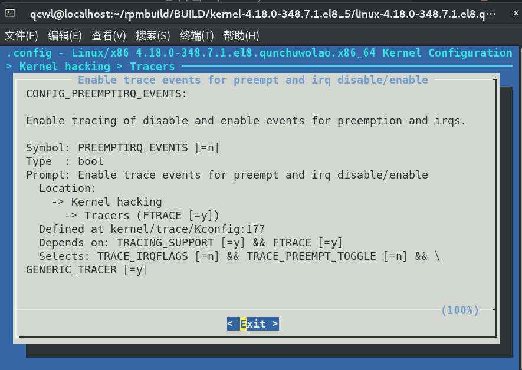
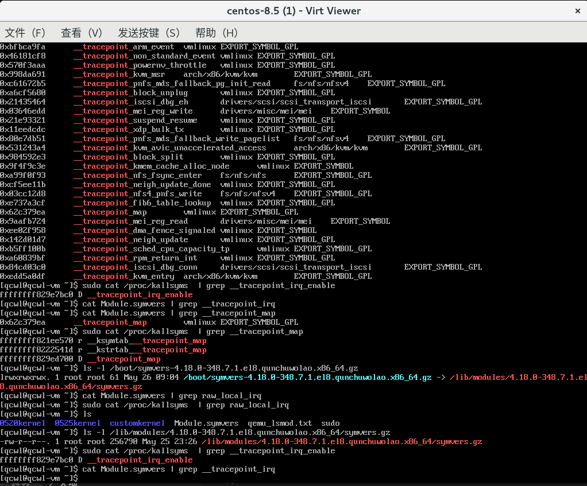

# 第 5 周

## 追踪关中断的方案选择

按照题目要求，我们需要“对指定中断或全部中断的关闭中断时长进行检测”，这就需要了解相关的调试追踪方案。

### Kprobe

```c
disable_irq(unsigned int irq) // 禁止指定中断号的中断，直到完成后才返回
disable_irq_nosync(unsigned int irq) // 禁止指定中断号的中断，立即返回
disable_hardirq(unsigned int irq) // 禁止指定中断号的中断，等待硬中断的完成
enable_irq(unsigned int irq) // 使能指定中断号的中断
```

对于以上四个导出的函数，利用 [kprobe](0522.md/#kprobe) 可以直接完成探测。然而，对于全部中断的关闭中断，`local_irq_disable`、`local_irq_enable` 这两个“函数”其实不是函数，而是宏；追踪下去，其中的语句不是宏就是内联的函数，经测试，kprobe 无法命中。这就要求我们考虑其他的方案。

### hrtimer

思路来源于[Kernel trace tools（一）：中断和软中断关闭时间过长问题追踪](https://blog.csdn.net/ByteDanceTech/article/details/105632131)。[hrtimer](https://zhuanlan.zhihu.com/p/450089796) 是 linux 中的高精度定时器，利用每个 CPU 本地的 `clock_event_device` 在计数值达到预设时引发时钟事件中断，继而触发回调函数。由于 hrtimer 时钟精度达到纳秒级，可以由其设定一个周期性的定时器，在其回调函数中判断当前时间和上次调用的时间之差是否明显大于我们设定的周期，如果是，说明时钟中断的相应被明显的退后，可以认为中间发生了关中断行为。但经过实测并结合理论分析发现，虽然 hrtimer 的时钟达到了纳秒级，但这种方法本质上是基于采样的，只能计算出关中断的时间落在哪个区间内，似乎和题目要求的“纳秒级精度”不相符。此外，受限于中断处理的速度等，经测试回调函数调用的时间也存在误差。

### TracePoint

在 5 月 25 日的会议上，马玉昆老师在了解了我们存在的问题后，建议我使用 tracepoint。[Tracepoint](https://www.kernel.org/doc/html/latest/translations/zh_CN/core-api/irq/irqflags-tracing.html) 是预先安排在内核中各种关键点上的静态探测点，被 eBPF 等技术使用。这样做的缺点是需要在编译内核时打开对应的编译选项，但优点是每次开关中断都会调用注册的回调函数，精度更高、更灵活。

由于：include/linux/irqflags.h
```c
#ifdef CONFIG_TRACE_IRQFLAGS
#define local_irq_enable() \
	do { trace_hardirqs_on(); raw_local_irq_enable(); } while (0)
#define local_irq_disable() \
	do { raw_local_irq_disable(); trace_hardirqs_off(); } while (0)
#define local_irq_save(flags)				\
	do {						\
		raw_local_irq_save(flags);		\
		trace_hardirqs_off();			\
	} while (0)


#define local_irq_restore(flags)			\
	do {						\
		if (raw_irqs_disabled_flags(flags)) {	\
			raw_local_irq_restore(flags);	\
			trace_hardirqs_off();		\
		} else {				\
			trace_hardirqs_on();		\
			raw_local_irq_restore(flags);	\
		}					\
	} while (0)

#define safe_halt()				\
	do {					\
		trace_hardirqs_on();		\
		raw_safe_halt();		\
	} while (0)


#else /* !CONFIG_TRACE_IRQFLAGS */

#define local_irq_enable()	do { raw_local_irq_enable(); } while (0)
#define local_irq_disable()	do { raw_local_irq_disable(); } while (0)
#define local_irq_save(flags)					\
	do {							\
		raw_local_irq_save(flags);			\
	} while (0)
#define local_irq_restore(flags) do { raw_local_irq_restore(flags); } while (0)
#define safe_halt()		do { raw_safe_halt(); } while (0)

#endif /* CONFIG_TRACE_IRQFLAGS */
```
注意到当 `CONFIG_TRACE_IRQFLAGS` 被定义时：
kernel/trace/trace_preemptirq.c：
```c
void trace_hardirqs_on(void)
{
	if (this_cpu_read(tracing_irq_cpu)) {
		if (!in_nmi())
			trace_irq_enable_rcuidle(CALLER_ADDR0, CALLER_ADDR1);
		tracer_hardirqs_on(CALLER_ADDR0, CALLER_ADDR1);
		this_cpu_write(tracing_irq_cpu, 0);
	}

	lockdep_hardirqs_on(CALLER_ADDR0);
}
```
因此在 menuconfig 中通过以下方式打开`CONFIG_TRACE_IRQFLAGS`：


此后我试图注册 trace_hardirqs_on，却在编译时得到了类似 `unknown symbol __tracepoint_irq_enable` 的警告，最终模块加载时注册失败。经查资料，我一度认为是由于符号没有导出所致，开发再度陷入停滞。实话说，网上那些资料基本都没有把怎么实现我这样的目标讲清楚。


最后我发现了[红帽工程师的代码](https://github.com/bristot/rtsl)，成功地完成 tracepoint 的注册。

### 抓取进程信息

我们假设，开中断时进程上下文中的进程应该就是关中断的那个进程；由于 [linux 进程调度发生的时机](https://developer.aliyun.com/article/254807) 可以分为进程终止或睡眠、时间片用完、设备驱动程序等主动放弃 CPU、进程从中断、异常及系统调用返回到用户态时，假定在关中断的场景下不会发生进程调度，即我们的 kprobe 和 tracepoint 回调函数中的进程上下文就是关中断的进程，直接读取对应的 `task_struct` 即可。

## 内核模块开发

### 关中断时动态分配内存
测试中遇到这样的内核崩溃问题，似乎出现某种递归：
```
[   40.839733] WARNING: stack recursion on stack type 5
[   40.839765] PANIC: double fault, error_code: 0x0
[   40.839765] CPU: 0 PID: 751 Comm: systemd-udevd Kdump: loaded Tainted: G           OE    --------- -  - 4.18.0-348.7.1.el8.qunchuwolao.x86_64 #1
[   40.839766] Hardware name: Red Hat KVM, BIOS 1.13.0-2.module_el8.5.0+746+bbd5d70c 04/01/2014
[   40.839766] RIP: 0010:get_partial+0x49/0x63
[   40.839766] Code: 01 00 00 44 89 e1 48 89 ea e8 d6 fb ff ff 5b 5d 41 5c c3 65 8b 05 f0 25 d4 7e 48 98 48 8b b4 c7 b0 01 00 00 44 89 e1 48 89 ea <e8> b5 fb ff ff 48 85 c0 75 da 48 89 ea 44 89 e6 48 89 df e8 0a fe
[   40.839767] RSP: 0000:fffffe0000007000 EFLAGS: 00010046
[   40.839767] RAX: 0000000000000000 RBX: ffff888100003180 RCX: 00000000006000c0
[   40.839767] RDX: ffff88813bc2e140 RSI: ffff888100000280 RDI: ffff888100003180
[   40.839768] RBP: ffff88813bc2e140 R08: ffff88813bc2e140 R09: ffffffff9d6afb7f
[   40.839768] R10: 0000000000000002 R11: 0000000000000000 R12: 00000000006000c0
[   40.839768] R13: 00000000ffffffff R14: ffff88813bc2e140 R15: ffff888100003180
[   40.839769] FS:  00007fab30015280(0000) GS:ffff88813bc00000(0000) knlGS:0000000000000000
[   40.839769] CS:  0010 DS: 0000 ES: 0000 CR0: 0000000080050033
[   40.839769] CR2: fffffe0000006ff8 CR3: 0000000101ada006 CR4: 0000000000370ef0
[   40.839769] Call Trace:
[   40.839769]  <#DF>
[   40.839770]  ___slab_alloc+0xdd/0x350
[   40.839770]  ? irqoff_handler+0x43/0xcc [local_irq_disable_trace]
[   40.839770]  ? irqoff_handler+0x43/0xcc [local_irq_disable_trace]
[   40.839771]  __slab_alloc+0x39/0x77
[   40.839778]  ? irqoff_handler+0x43/0xcc [local_irq_disable_trace]
[   40.839779]  kmem_cache_alloc_trace+0xd9/0x26b
[   40.839779]  irqoff_handler+0x43/0xcc [local_irq_disable_trace]
[   40.839779]  ? _raw_spin_lock_irqsave+0x40/0x50
[   40.839779]  trace_hardirqs_off+0x89/0xaa
[   40.839780]  _raw_spin_lock_irqsave+0x40/0x50
[   40.839780]  get_page_from_freelist+0x306/0xb25
[   40.839780]  __alloc_pages_nodemask+0x1b3/0x2e4
[   40.839780]  alloc_pages_current+0x74/0x91
[   40.839781]  allocate_slab+0xc6/0x2ef
[   40.839781]  new_slab+0x24/0x32
[   40.839781]  ___slab_alloc+0x25b/0x350
[   40.839781]  ? irqoff_handler+0x43/0xcc [local_irq_disable_trace]
[   40.839782]  ? irqoff_handler+0x43/0xcc [local_irq_disable_trace]
[   40.839782]  __slab_alloc+0x39/0x77
[   40.839782]  ? irqoff_handler+0x43/0xcc [local_irq_disable_trace]
[   40.839782]  kmem_cache_alloc_trace+0xd9/0x26b
[   40.839783]  irqoff_handler+0x43/0xcc [local_irq_disable_trace]
[   40.839783]  ? _raw_spin_lock_irqsave+0x40/0x50
[   40.839783]  trace_hardirqs_off+0x89/0xaa
[   40.839783]  _raw_spin_lock_irqsave+0x40/0x50
[   40.839783]  get_page_from_freelist+0x306/0xb25
[   40.839784]  __alloc_pages_nodemask+0x1b3/0x2e4
[   40.839784]  alloc_pages_current+0x74/0x91
[   40.839784]  allocate_slab+0xc6/0x2ef
[   40.839784]  new_slab+0x24/0x32
[   40.839785]  ___slab_alloc+0x25b/0x350
[   40.839785]  ? irqoff_handler+0x43/0xcc [local_irq_disable_trace]
[   40.839785]  ? irqoff_handler+0x43/0xcc [local_irq_disable_trace]
[   40.839785]  __slab_alloc+0x39/0x77
[   40.839786]  ? irqoff_handler+0x43/0xcc [local_irq_disable_trace]
[   40.839786]  kmem_cache_alloc_trace+0xd9/0x26b
[   40.839786]  irqoff_handler+0x43/0xcc [local_irq_disable_trace]
[   40.839786]  ? _raw_spin_lock_irqsave+0x40/0x50
[   40.839787]  trace_hardirqs_off+0x89/0xaa
[   40.839787]  _raw_spin_lock_irqsave+0x40/0x50
[   40.839787]  get_page_from_freelist+0x306/0xb25
[   40.839787]  __alloc_pages_nodemask+0x1b3/0x2e4
[   40.839787]  alloc_pages_current+0x74/0x91
[   40.839788]  allocate_slab+0xc6/0x2ef
[   40.839788]  ? may_delete+0x153/0x191
[   40.839788]  ? check_pointer+0x15/0x3f
[   40.839788]  ? vsnprintf+0x3f3/0x5ce
[   40.839789]  ? sprintf+0x57/0x6e
[   40.839789]  ? __sprint_symbol+0xf7/0x102
[   40.839789]  ? string_nocheck+0x69/0x6a
[   40.839789]  ? symbol_string+0x57/0x99
[   40.839789]  ? check_pointer+0x15/0x3f
[   40.839790]  ? string_nocheck+0x69/0x6a
[   40.839790]  ? vsnprintf+0x9b/0x5ce
[   40.839790]  ? irq_work_queue+0xa/0x1f
[   40.839790]  ? queue_flush_work+0x1d/0x1f
[   40.839791]  ? printk_safe_log_store+0xc6/0xd0
[   40.839791]  ? printk_safe_log_store+0xc6/0xd0
[   40.839791]  ? printk_safe_log_store+0xc6/0xd0
[   40.839791]  ? vprintk_nmi+0x22/0x23
[   40.839791]  ? vprintk_func+0x97/0xaa
[   40.839792]  ? printk+0x59/0x70
[   40.839792]  ? __module_text_address+0xe/0x5b
[   40.839792]  ? is_bpf_text_address+0xa/0x11
[   40.839792]  ? __kernel_text_address+0x1f/0x2b
[   40.839793]  ? show_trace_log_lvl+0x1f8/0x2e3
[   40.839793]  ? show_trace_log_lvl+0x1f8/0x2e3
[   40.839793]  ? show_regs+0x5a/0x5c
[   40.839793]  ? df_debug+0x1d/0x29
[   40.839793]  ? do_double_fault+0xf8/0x188
[   40.839794]  ? double_fault+0x23/0x30
[   40.839794]  ? get_partial+0x49/0x63
[   40.839794]  </#DF>
[   40.839794] Kernel panic - not syncing: Machine halted.
[   40.839795] CPU: 0 PID: 751 Comm: systemd-udevd Kdump: loaded Tainted: G           OE    --------- -  - 4.18.0-348.7.1.el8.qunchuwolao.x86_64 #1
[   40.839795] Hardware name: Red Hat KVM, BIOS 1.13.0-2.module_el8.5.0+746+bbd5d70c 04/01/2014
[   40.839795] Call Trace:
[   40.839796]  <#DF>
[   40.839796]  ? __dump_stack+0x1b/0x1c
[   40.839796]  ? dump_stack+0x6e/0x9e
[   40.839796]  ? panic+0x101/0x29e
[   40.839796]  ? df_debug+0x29/0x29
[   40.839797]  ? do_double_fault+0xf8/0x188
[   40.839797]  ? double_fault+0x23/0x30
[   40.839797]  ? get_partial+0x49/0x63
[   40.839802]  </#DF>
[   40.844851] PANIC: double fault, error_code: 0x0
[   40.844852] CPU: 0 PID: 751 Comm: systemd-udevd Kdump: loaded Tainted: G           OE    --------- -  - 4.18.0-348.7.1.el8.qunchuwolao.x86_64 #1
[   40.844852] Hardware name: Red Hat KVM, BIOS 1.13.0-2.module_el8.5.0+746+bbd5d70c 04/01/2014
[   40.844852] RIP: 0010:error_entry+0x11/0x170
[   40.844853] Code: db 0f 85 ab f8 ff ff 0f 01 f8 e9 a3 f8 ff ff 66 2e 0f 1f 84 00 00 00 00 00 fc 56 48 8b 74 24 08 48 89 7c 24 08 52 51 50 41 50 <41> 51 41 52 41 53 53 55 41 54 41 55 41 56 41 57 56 31 d2 31 c9 45
[   40.844853] RSP: 0018:fffffe0000007000 EFLAGS: 00010083
[   40.844854] RAX: 0000000081a00be7 RBX: 0000000000000000 RCX: ffffffff81a00be7
[   40.844854] RDX: 0000000000000000 RSI: ffffffff81a01158 RDI: ffffffff81a013c8
[   40.844854] RBP: fffffe00000070d0 R08: 0000000000000000 R09: 0000000000000000
[   40.844855] R10: 0000000000000000 R11: 0000000000000000 R12: 0000000000000000
[   40.844855] R13: 0000000000000000 R14: 0000000000000000 R15: 0000000000000000
[   40.844855] FS:  0000000000000000(0018) GS:ffff88813bc00000(0018) knlGS:0000000000000000
[   40.844855] CS:  0010 DS: 0018 ES: 0018 CR0: 0000000080050033
[   40.844856] CR2: fffffe0000006ff8 CR3: 0000000101ada006 CR4: 0000000000370ef0
[   40.844856] Call Trace:
[   40.844856]  <#DF>
[   40.844856]  ? native_iret+0x7/0x7
[   40.844856]  ? page_fault+0x8/0x30
[   40.844857]  error_entry+0xa8/0x170
[   40.844857] RIP: 81a01158:0x0
[   40.844857] Code: Unable to access opcode bytes at RIP 0xffffffffffffffd6.
[   40.844857] RSP: 81a013c8:0000000000000000 EFLAGS: ffffffff81a013c8 ORIG_RAX: ffffffff81a00be7
[   40.844858] RAX: 0000000000000000 RBX: 0000000000000000 RCX: 0000000000000000
[   40.844858] RDX: 0000000000000000 RSI: 0000000000000000 RDI: 0000000081a00be7
[   40.844858] RBP: 0000000000000018 R08: ffffffff81001eea R09: 0000000000000000
[   40.844859] R10: 0000000000000000 R11: fffffe00000070d0 R12: fffffe0000007060
[   40.844859] R13: 0000000000010083 R14: 0000000000000010 R15: ffffffff811e0064
[   40.844859]  ? trace_hardirqs_off_caller+0x6/0xb2
[   40.844860]  ? trace_hardirqs_off_thunk+0x1a/0x2b
[   40.844860]  ? native_iret+0x7/0x7
[   40.844860]  ? page_fault+0x8/0x30
[   40.844860]  ? error_entry+0xa8/0x170
[   40.844860]  ? error_entry+0xa8/0x170
[   40.844861]  ? page_fault+0x8/0x30
[   40.844861]  ? native_iret+0x7/0x7
[   40.844861]  ? page_fault+0x8/0x30
[   40.844861]  ? error_entry+0xa8/0x170
[   40.844861]  ? trace_hardirqs_off_caller+0x6/0xb2
[   40.844862]  ? trace_hardirqs_off_thunk+0x1a/0x2b
[   40.844862]  ? native_iret+0x7/0x7
[   40.844862]  ? page_fault+0x8/0x30
[   40.844862]  ? error_entry+0xa8/0x170
[   40.844863]  ? error_entry+0xa8/0x170
[   40.844863]  ? page_fault+0x8/0x30
[   40.844863]  ? native_iret+0x7/0x7
[   40.844863]  ? page_fault+0x8/0x30
[   40.844863]  ? error_entry+0xa8/0x170
[   40.844864]  ? trace_hardirqs_off_caller+0x6/0xb2
[   40.844864]  ? trace_hardirqs_off_thunk+0x1a/0x2b
[   40.844864]  ? native_iret+0x7/0x7
[   40.844864]  ? page_fault+0x8/0x30
[   40.844865]  ? error_entry+0xa8/0x170
[   40.844865]  ? error_entry+0xa8/0x170
[   40.844865]  ? page_fault+0x8/0x30
[   40.844865]  ? native_iret+0x7/0x7
[   40.844865]  ? page_fault+0x8/0x30
[   40.844866]  ? error_entry+0xa8/0x170
[   40.844866]  ? trace_hardirqs_off_caller+0x6/0xb2
[   40.844866]  ? trace_hardirqs_off_thunk+0x1a/0x2b
[   40.844866]  ? native_iret+0x7/0x7
[   40.844866]  ? page_fault+0x8/0x30
[   40.844867]  ? error_entry+0xa8/0x170
[   40.844867]  ? error_entry+0xa8/0x170
[   40.844867]  ? page_fault+0x8/0x30
[   40.844867]  ? native_iret+0x7/0x7
[   40.844868]  ? page_fault+0x8/0x30
[   40.844868]  ? error_entry+0xa8/0x170
[   40.844868]  ? trace_hardirqs_off_caller+0x6/0xb2
[   40.844868]  ? trace_hardirqs_off_thunk+0x1a/0x2b
[   40.844869]  ? native_iret+0x7/0x7
[   40.844869]  ? page_fault+0x8/0x30
[   40.844877]  ? error_entry+0xa8/0x170
[   40.844877]  ? error_entry+0xa8/0x170
[   40.844877]  ? page_fault+0x8/0x30
[   40.844877]  ? native_iret+0x7/0x7
[   40.844878]  ? page_fault+0x8/0x30
[   40.844878]  ? error_entry+0xa8/0x170
[   40.844878]  ? trace_hardirqs_off_caller+0x6/0xb2
[   40.844878]  ? trace_hardirqs_off_thunk+0x1a/0x2b
[   40.844879]  ? native_iret+0x7/0x7
[   40.844879]  ? page_fault+0x8/0x30
[   40.844879]  ? error_entry+0xa8/0x170
[   40.844879]  ? error_entry+0xa8/0x170
[   40.844879]  ? page_fault+0x8/0x30
[   40.844880]  ? native_iret+0x7/0x7
[   40.844880]  ? page_fault+0x8/0x30
[   40.844880]  ? error_entry+0xa8/0x170
[   40.844880]  ? trace_hardirqs_off_caller+0x6/0xb2
[   40.844881]  ? trace_hardirqs_off_thunk+0x1a/0x2b
[   40.844881]  ? native_iret+0x7/0x7
[   40.844881]  ? page_fault+0x8/0x30
[   40.844881]  ? error_entry+0xa8/0x170
[   40.844881]  ? error_entry+0xa8/0x170
[   40.844882]  ? page_fault+0x8/0x30
[   40.844882]  ? native_iret+0x7/0x7
[   40.844882]  ? page_fault+0x8/0x30
[   40.844882]  ? error_entry+0xa8/0x170
[   40.844882]  ? trace_hardirqs_off_caller+0x6/0xb2
[   40.844883]  ? trace_hardirqs_off_thunk+0x1a/0x2b
[   40.844883]  ? native_iret+0x7/0x7
[   40.844883]  ? page_fault+0x8/0x30
[   40.844883]  ? error_entry+0xa8/0x170
[   40.844884]  ? error_entry+0xa8/0x170
[   40.844884]  ? page_fault+0x8/0x30
[   40.844884]  ? native_iret+0x7/0x7
[   40.844884]  ? page_fault+0x8/0x30
[   40.844884]  ? vsnprintf+0x3f3/0x5ce
[   40.844885]  ? vsnprintf+0x3f3/0x5ce
[   40.844885]  ? sprintf+0x57/0x6e
[   40.844885]  ? __sprint_symbol+0xf7/0x102
[   40.844885]  ? string_nocheck+0x69/0x6a
[   40.844886]  ? symbol_string+0x57/0x99
[   40.844886]  ? vsnprintf+0x9b/0x5ce
[   40.844886]  ? error_entry+0xa8/0x170
[   40.844886]  ? trace_hardirqs_off_caller+0x6/0xb2
[   40.844886]  ? vsnprintf+0x9b/0x5ce
[   40.844887]  ? check_pointer+0x15/0x3f
[   40.844887]  ? string_nocheck+0x69/0x6a
[   40.844887]  ? vsnprintf+0x9b/0x5ce
[   40.844887]  ? irq_work_queue+0xa/0x1f
[   40.844888]  ? queue_flush_work+0x1d/0x1f
[   40.844888]  ? printk_safe_log_store+0xc6/0xd0
[   40.844888]  ? printk_safe_log_store+0xc6/0xd0
[   40.844888]  ? printk_safe_log_store+0xc6/0xd0
[   40.844888]  ? vprintk_nmi+0x22/0x23
[   40.844889]  ? vprintk_func+0x97/0xaa
[   40.844889]  ? printk+0x59/0x70
[   40.844889]  ? __module_text_address+0xe/0x5b
[   40.844889]  ? is_bpf_text_address+0xa/0x11
[   40.844890]  ? __kernel_text_address+0x1f/0x2b
[   40.844890]  ? show_trace_log_lvl+0x1f8/0x2e3
[   40.844890]  ? show_trace_log_lvl+0x1f8/0x2e3
[   40.844890]  ? show_regs+0x5a/0x5c
[   40.844890]  ? df_debug+0x1d/0x29
[   40.844891]  ? do_double_fault+0xf8/0x188
[   40.844891]  ? double_fault+0x23/0x30
[   40.844891]  ? native_iret+0x7/0x7
[   40.844891]  ? page_fault+0x8/0x30
[   40.844892]  ? error_entry+0xa8/0x170
[   40.844892]  ? error_entry+0x11/0x170
[   40.844892]  </#DF>
[   40.844892] Kernel panic - not syncing: Machine halted.
[   41.920659] Shutting down cpus with NMI
[   41.920660] Kernel Offset: disabled
```
反汇编，在`irqoff_handler+0x43/0xcc`处：
```
		return kmem_cache_alloc_trace(
 248:	ba 00 02 00 00       	mov    $0x200,%edx
 24d:	be c0 00 60 00       	mov    $0x6000c0,%esi
 252:	48 8b 3d 00 00 00 00 	mov    0x0(%rip),%rdi        # 259 <irqoff_handler+0x3e>
 259:	e8 00 00 00 00       	callq  25e <irqoff_handler+0x43>
 25e:	48 89 45 00          	mov    %rax,0x0(%rbp)
 ```
应该是我们的模块在动态分配内存时触发了关中断，造成无穷递归调用，导致内核栈溢出。

对此，一方面设一个变量`local_tracing`标记是否正在执行 tracepoint 回调以避免追踪自身引起的关中断；另一方面，经[查资料](https://cloud.tencent.com/developer/article/1893089)，应该使用 `GFP_ATOMIC` 而不是 `GFP_KERNEL`，后者可能会造成睡眠，这是关中断时不能出现的。
