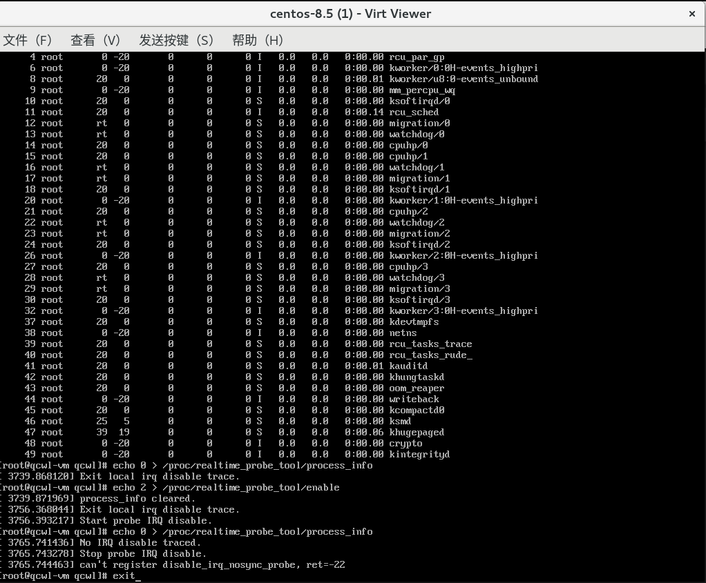

# 第 6 周

叶景熙同学已经完成了 procfs 部分，由他先根据主办方给出的提示撰写文档；我还需要一些时间解决现存的问题。

## 多线程相关问题

### 采用的追踪技术对并发的处理

中断的处理者是处理器，APIC 会把中断传给指定的处理器，由指定的处理器处理，不同的 CPU 处理中断时具有相对的独立性，我们所说的关闭所有中断`local_irq_disable`其实也是指的关闭执行到此的单一 CPU 的中断。因此，不同的处理器可能同时执行关中断，或者一个处理器在另一处理器还没执行完我们的回调函数时又进入回调函数。

对于可能出现的并发和竞态问题，我们需要针对屏蔽单一中断和关闭所有中断分别分析：

屏蔽单一中断使用的是 kprobe，经查，在 SMP 机器上同时命中的话，[kprobe 能保证串行化处理](https://lwn.net/Articles/132196/)，因此似乎不存在问题；此外，kprobe [有 spinlock](https://lwn.net/Articles/132196/)，在执行 unregister 的时候保证函数的执行不会从中间被截断，退出时也不存在问题。不过，似乎不能在调用 unregister 后立即调用 register，我猜测可能是因为 unregister 是异步的，返回时还没注销完。这样，我们仍然需要设计一套处理机制来处理并发。



我似乎没有在网络上找到关于关中断（`local_irq_disable`）使用的 tracepoint 的相关讨论，根据我的分析，tracepoint 命中时会关抢占，但好像没有并发相关的保护措施，这也需要我尝试进行一番处理。

由于每个线程有自己的栈，影响的主要是全局变量。受影响的全局变量主要是记录是否有关中断、上次关中断的时间、关中断的链表、关中断时的堆栈信息等。不会多线程写的变量，如时间阈值，则受影响小。可以看出，受影响大的全局变量是和 CPU 相关的，可以让不同的 CPU 独立地记录以上信息，等清零或输出时再统一处理。这样可以使用 PER CPU 机制。

### PER CPU

PER CPU 机制可以让某一全局变量在所有 CPU 上均有自己独立的副本，通过不维持核间同步解决数据争用问题。导入头文件 `linux/percpu.h` 后，通过 `DEFINE_PER_CPU(type, name)` 可以定义 PER CPU 变量，使用 `this_cpu_ptr` 和 `per_cpu_ptr` 完成对当前 CPU 和指定 CPU 上 PER CPU 变量的访问。使用 `for_each_present_cpu` 系列的宏配合 `per_cpu_ptr` 可以实现遍历。

我把相关的变量用 PER CPU 定义后，本来采用的方法是定义 PER CPU 的自旋锁，在输出所有 CPU 上的关中断信息（遍历链表）或记录新的关中断信息（插入链表结点）时关自旋锁，操作完毕后开锁，但模块很不稳定，有时加载几秒后就崩溃，其余的时候输出所有关中断信息时也会崩溃。经多次调试，发现本来执行两个回调函数时中断、抢占应该处于关闭状态，事实上抢占却是开启的，这才发现这里不可以使用自旋锁，因为不管在执行 `spin_lock` 时是否已关闭抢占，调用 `spin_unlock` 时都必然会打开抢占。我们需要一个不改动抢占的“自旋锁”。

### 原子操作

x86_64 有一些原子性的指令，执行这些指令是“瞬间完成”的，能解决数据争用带来的不确定性。Linux 内核提供了[原子读写 API](https://www.linuxidc.com/Linux/2011-10/44627p2.htm)，可对 `atomic_t` 类型的变量进行操作，如 `atomic_set`（写）、`atomic_read`（读）、 `int atomic_cmpxchg(atomic_t *v, int old, int new)`（由 `cmpxchg` 指令实现，如果 old 与原子类型变量值相同，就把新值存入原子类型变量值中，返回原子类型变量原来的值）等。因此，我想，用 `while (!atomic_cmpxchg(&your_var, 1, 0)) ;`可以实现类似获取自旋锁的效果；用 `atomic_set(&your_var, 1);` 可以实现类似自旋锁释放的效果。

## 内核模块开发

### kfree 引发的递归

解决了[动态分配内存引发的问题](0525.md#关中断时动态分配内存)，又出现新的崩溃，似乎同样是某种形式的内核栈溢出：
```
[   80.509350] general protection fault: 0000 [#1] SMP NOPTI
[   80.511348] CPU: 0 PID: 1543 Comm: rmmod Kdump: loaded Tainted: G           OE    --------- -  - 4.18.0-348.7.1.el8.qunchuwolao.x86_64 #1
[   80.515942] Hardware name: Red Hat KVM, BIOS 1.13.0-2.module_el8.5.0+746+bbd5d70c 04/01/2014
[   80.518800] RIP: 0010:print_list+0x3b/0xc4 [local_irq_disable_trace]
[   80.521061] Code: fd 48 8b 07 48 8d 58 c8 49 c7 c7 bb e0 59 a0 49 c7 c6 d6 e0 59 a0 48 8d 43 38 49 39 c5 75 0b 5b 5d 41 5c 41 5d 41 5e 41 5f c3 <48> 8b 6b 30 8b 53 14 48 8b 73 28 4c 8d 43 04 8b 0b 48 c7 c7 28 e0
[   80.527934] RSP: 0018:ffffc90000f87e20 EFLAGS: 00010202
[   80.530158] RAX: dead000000000100 RBX: dead0000000000c8 RCX: 0000000000000000
[   80.532849] RDX: 0000000000000000 RSI: ffff88813bc15858 RDI: ffff88813bc15858
[   80.535675] RBP: 0000000000000000 R08: 000000000f10ec84 R09: ffffffff9d6932bc
[   80.538278] R10: 0000000000000003 R11: ffffffffa009b080 R12: 000000000000000f
[   80.541110] R13: ffff88813bc2c298 R14: ffffffffa059e0d6 R15: ffffffffa059e0bb
[   80.543862] FS:  00007f5d0989a740(0000) GS:ffff88813bc00000(0000) knlGS:0000000000000000
[   80.546955] CS:  0010 DS: 0000 ES: 0000 CR0: 0000000080050033
[   80.549198] CR2: 00007f5d087b0a50 CR3: 0000000126a1e002 CR4: 0000000000370ef0
[   80.552019] Call Trace:
[   80.553294]  local_irq_disable_output+0xca/0xcc [local_irq_disable_trace]
[   80.555921]  exit_module+0xf/0x7bf [local_irq_disable_trace]
[   80.558143]  __se_sys_delete_module+0x152/0x2a8
[   80.560430]  __x64_sys_delete_module+0x12/0x13
[   80.562476]  do_syscall_64+0x85/0x1b2
[   80.564303]  entry_SYSCALL_64_after_hwframe+0x6a/0xdf
[   80.566360] RIP: 0033:0x7f5d0887271b
[   80.567895] Code: 73 01 c3 48 8b 0d 6d 17 2c 00 f7 d8 64 89 01 48 83 c8 ff c3 66 2e 0f 1f 84 00 00 00 00 00 90 f3 0f 1e fa b8 b0 00 00 00 0f 05 <48> 3d 01 f0 ff ff 73 01 c3 48 8b 0d 3d 17 2c 00 f7 d8 64 89 01 48
[   80.575070] RSP: 002b:00007ffc926be478 EFLAGS: 00000206 ORIG_RAX: 00000000000000b0
[   80.578061] RAX: ffffffffffffffda RBX: 000055c5b2dd3750 RCX: 00007f5d0887271b
[   80.580743] RDX: 000000000000000a RSI: 0000000000000800 RDI: 000055c5b2dd37b8
[   80.583426] RBP: 0000000000000000 R08: 00007ffc926bd3f1 R09: 0000000000000000
[   80.585801] R10: 00007f5d088e6280 R11: 0000000000000206 R12: 00007ffc926be6a0
[   80.588781] R13: 00007ffc926bf8e3 R14: 000055c5b2dd32a0 R15: 000055c5b2dd3750
[   80.591814] Modules linked in: local_irq_disable_trace(OE-) nft_fib_inet nft_fib_ipv4 nft_fib_ipv6 nft_fib nft_reject_inet nf_reject_ipv4 nf_reject_ipv6 nft_reject nft_ct nf_tables_set nft_chain_nat nf_nat nf_conntrack nf_defrag_ipv6 nf_defrag_ipv4 ip_set nf_tables nfnetlink intel_rapl_msr intel_rapl_common intel_pmc_core kvm_intel kvm irqbypass crct10dif_pclmul crc32_pclmul ghash_clmulni_intel rapl pcspkr virtio_balloon i2c_piix4 xfs libcrc32c sr_mod cdrom sd_mod t10_pi sg ata_generic qxl drm_ttm_helper ttm drm_kms_helper syscopyarea sysfillrect ata_piix sysimgblt fb_sys_fops drm libata crc32c_intel serio_raw dm_mirror dm_region_hash dm_log dm_mod
[   80.619164] BUG: stack guard page was hit at 0000000035d2e274 (stack is 000000004ca7e3fe..0000000013b82bfe)
[   80.619164] kernel stack overflow (double-fault): 0000 [#2] SMP NOPTI
[   80.619165] CPU: 0 PID: 1543 Comm: rmmod Kdump: loaded Tainted: G           OE    --------- -  - 4.18.0-348.7.1.el8.qunchuwolao.x86_64 #1
[   80.619165] Hardware name: Red Hat KVM, BIOS 1.13.0-2.module_el8.5.0+746+bbd5d70c 04/01/2014
[   80.619165] RIP: 0010:error_entry+0x11/0x170
[   80.619166] Code: db 0f 85 ab f8 ff ff 0f 01 f8 e9 a3 f8 ff ff 66 2e 0f 1f 84 00 00 00 00 00 fc 56 48 8b 74 24 08 48 89 7c 24 08 52 51 50 41 50 <41> 51 41 52 41 53 53 55 41 54 41 55 41 56 41 57 56 31 d2 31 c9 45
[   80.619166] RSP: 0018:ffffc90000f84000 EFLAGS: 00010083
[   80.619167] RAX: 0000000081a00be7 RBX: 0000000000000000 RCX: ffffffff81a00be7
[   80.619167] RDX: 0000000000000000 RSI: ffffffff81a01158 RDI: ffffffff81a013c8
[   80.619167] RBP: ffffc90000f840d0 R08: 0000000000000000 R09: 0000000000000000
[   80.619167] R10: 0000000000000000 R11: 0000000000000000 R12: 0000000000000000
[   80.619168] R13: 0000000000000000 R14: 0000000000000000 R15: 0000000000000000
[   80.619168] FS:  0000000000000000(0018) GS:ffff88813bc00000(0018) knlGS:0000000000000000
[   80.619168] CS:  0010 DS: 0018 ES: 0018 CR0: 0000000080050033
[   80.619169] CR2: ffffc90000f83ff8 CR3: 0000000126a1e002 CR4: 0000000000370ef0
[   80.619169] Call Trace:
[   80.619179]  ? native_iret+0x7/0x7
[   80.619179]  ? page_fault+0x8/0x30
[   80.619180]  error_entry+0xa8/0x170
[   80.619180] RIP: 81a01158:0x0
[   80.619187] Code: Unable to access opcode bytes at RIP 0xffffffffffffffd6.
[   80.619187] RSP: 81a013c8:0000000000000000 EFLAGS: ffffffff81a013c8 ORIG_RAX: ffffffff81a00be7
[   80.619188] RAX: 0000000000000000 RBX: 0000000000000000 RCX: 0000000000000000
[   80.619188] RDX: 0000000000000000 RSI: 0000000000000000 RDI: 0000000081a00be7
[   80.619188] RBP: 0000000000000018 R08: ffffffff81001eea R09: 0000000000000000
[   80.619189] R10: 0000000000000000 R11: ffffc90000f840d0 R12: ffffc90000f84060
[   80.619189] R13: 0000000000010083 R14: 0000000000000010 R15: ffffffff811e0064
[   80.619189]  ? trace_hardirqs_off_caller+0x6/0xb2
[   80.619190]  ? trace_hardirqs_off_thunk+0x1a/0x2b
[   80.619190]  ? native_iret+0x7/0x7
[   80.619190]  ? page_fault+0x8/0x30
[   80.619190]  ? error_entry+0xa8/0x170
[   80.619190]  ? error_entry+0xa8/0x170
[   80.619191]  ? page_fault+0x8/0x30
[   80.619191]  ? native_iret+0x7/0x7
[   80.619191]  ? page_fault+0x8/0x30
[   80.619191]  ? error_entry+0xa8/0x170
[   80.619192]  ? trace_hardirqs_off_caller+0x6/0xb2
[   80.619192]  ? trace_hardirqs_off_thunk+0x1a/0x2b
[   80.619192]  ? native_iret+0x7/0x7
[   80.619192]  ? page_fault+0x8/0x30
[   80.619192]  ? error_entry+0xa8/0x170
[   80.619193]  ? error_entry+0xa8/0x170
[   80.619193]  ? page_fault+0x8/0x30
[   80.619193]  ? native_iret+0x7/0x7
[   80.619193]  ? page_fault+0x8/0x30
[   80.619194]  ? error_entry+0xa8/0x170
[   80.619194]  ? trace_hardirqs_off_caller+0x6/0xb2
[   80.619194]  ? trace_hardirqs_off_thunk+0x1a/0x2b
[   80.619194]  ? native_iret+0x7/0x7
[   80.619194]  ? page_fault+0x8/0x30
[   80.619195]  ? error_entry+0xa8/0x170
[   80.619195]  ? error_entry+0xa8/0x170
[   80.619195]  ? page_fault+0x8/0x30
[   80.619195]  ? native_iret+0x7/0x7
[   80.619196]  ? page_fault+0x8/0x30
[   80.619196]  ? error_entry+0xa8/0x170
[   80.619196]  ? trace_hardirqs_off_caller+0x6/0xb2
[   80.619196]  ? trace_hardirqs_off_thunk+0x1a/0x2b
[   80.619196]  ? native_iret+0x7/0x7
[   80.619197]  ? page_fault+0x8/0x30
[   80.619197]  ? error_entry+0xa8/0x170
[   80.619197]  ? error_entry+0xa8/0x170
[   80.619197]  ? page_fault+0x8/0x30
[   80.619198]  ? native_iret+0x7/0x7
[   80.619198]  ? page_fault+0x8/0x30
[   80.619198]  ? error_entry+0xa8/0x170
[   80.619198]  ? trace_hardirqs_off_caller+0x6/0xb2
[   80.619198]  ? trace_hardirqs_off_thunk+0x1a/0x2b
[   80.619199]  ? native_iret+0x7/0x7
[   80.619199]  ? page_fault+0x8/0x30
[   80.619199]  ? error_entry+0xa8/0x170
[   80.619199]  ? error_entry+0xa8/0x170
[   80.619200]  ? page_fault+0x8/0x30
[   80.619200]  ? native_iret+0x7/0x7
[   80.619200]  ? page_fault+0x8/0x30
[   80.619200]  ? error_entry+0xa8/0x170
[   80.619200]  ? trace_hardirqs_off_caller+0x6/0xb2
[   80.619201]  ? trace_hardirqs_off_thunk+0x1a/0x2b
[   80.619201]  ? native_iret+0x7/0x7
[   80.619201]  ? page_fault+0x8/0x30
[   80.619201]  ? error_entry+0xa8/0x170
[   80.619202]  ? error_entry+0xa8/0x170
[   80.619202]  ? page_fault+0x8/0x30
[   80.619202]  ? native_iret+0x7/0x7
[   80.619202]  ? page_fault+0x8/0x30
[   80.619202]  ? error_entry+0xa8/0x170
[   80.619203]  ? trace_hardirqs_off_caller+0x6/0xb2
[   80.619203]  ? trace_hardirqs_off_thunk+0x1a/0x2b
[   80.619203]  ? native_iret+0x7/0x7
[   80.619203]  ? page_fault+0x8/0x30
[   80.619204]  ? error_entry+0xa8/0x170
[   80.619204]  ? error_entry+0xa8/0x170
[   80.619204]  ? page_fault+0x8/0x30
[   80.619204]  ? native_iret+0x7/0x7
[   80.619204]  ? page_fault+0x8/0x30
[   80.619205]  ? error_entry+0xa8/0x170
[   80.619205]  ? trace_hardirqs_off_caller+0x6/0xb2
[   80.619205]  ? trace_hardirqs_off_thunk+0x1a/0x2b
[   80.619205]  ? native_iret+0x7/0x7
[   80.619205]  ? page_fault+0x8/0x30
[   80.619206]  ? error_entry+0xa8/0x170
[   80.619206]  ? error_entry+0xa8/0x170
[   80.619206]  ? page_fault+0x8/0x30
[   80.619206]  ? native_iret+0x7/0x7
[   80.619207]  ? page_fault+0x8/0x30
[   80.619212]  ? error_entry+0xa8/0x170
[   80.619213]  ? trace_hardirqs_off_caller+0x6/0xb2
[   80.619213]  ? trace_hardirqs_off_thunk+0x1a/0x2b
[   80.619213]  ? native_iret+0x7/0x7
[   80.619213]  ? page_fault+0x8/0x30
[   80.619213]  ? error_entry+0xa8/0x170
[   80.619214]  ? error_entry+0xa8/0x170
[   80.619214]  ? page_fault+0x8/0x30
[   80.619214]  ? native_iret+0x7/0x7
[   80.619214]  ? page_fault+0x8/0x30
[   80.619214]  ? error_entry+0xa8/0x170
[   80.619215]  ? trace_hardirqs_off_caller+0x6/0xb2
[   80.619215]  ? trace_hardirqs_off_thunk+0x1a/0x2b
[   80.619215]  ? native_iret+0x7/0x7
[   80.619215]  ? page_fault+0x8/0x30
[   80.619216]  ? error_entry+0xa8/0x170
[   80.619216]  ? error_entry+0xa8/0x170
[   80.619216]  ? page_fault+0x8/0x30
[   80.619216]  ? native_iret+0x7/0x7
[   80.619216]  ? page_fault+0x8/0x30
[   80.619217]  ? error_entry+0xa8/0x170
[   80.619217]  ? trace_hardirqs_off_caller+0x6/0xb2
[   80.619217]  ? trace_hardirqs_off_thunk+0x1a/0x2b
[   80.619217]  ? native_iret+0x7/0x7
[   80.619218]  ? page_fault+0x8/0x30
[   80.619218]  ? error_entry+0xa8/0x170
[   80.619218]  ? error_entry+0xa8/0x170
[   80.619218]  ? page_fault+0x8/0x30
[   80.619218]  ? native_iret+0x7/0x7
[   80.619219]  ? page_fault+0x8/0x30
[   80.619219]  ? error_entry+0xa8/0x170
[   80.619219]  ? trace_hardirqs_off_caller+0x6/0xb2
[   80.619219]  ? trace_hardirqs_off_thunk+0x1a/0x2b
[   80.619220]  ? native_iret+0x7/0x7
[   80.619220]  ? page_fault+0x8/0x30
[   80.619220]  ? error_entry+0xa8/0x170
[   80.619220]  ? error_entry+0xa8/0x170
[   80.619220]  ? page_fault+0x8/0x30
[   80.619221]  ? native_iret+0x7/0x7
[   80.619221]  ? page_fault+0x8/0x30
[   80.619221]  ? error_entry+0xa8/0x170
[   80.619221]  ? trace_hardirqs_off_caller+0x6/0xb2
[   80.619221]  ? trace_hardirqs_off_thunk+0x1a/0x2b
[   80.619222]  ? native_iret+0x7/0x7
[   80.619222]  ? page_fault+0x8/0x30
[   80.619222]  ? error_entry+0xa8/0x170
[   80.619222]  ? error_entry+0xa8/0x170
[   80.619223]  ? page_fault+0x8/0x30
[   80.619223]  ? native_iret+0x7/0x7
[   80.619223]  ? page_fault+0x8/0x30
[   80.619223]  ? error_entry+0xa8/0x170
[   80.619223]  ? trace_hardirqs_off_caller+0x6/0xb2
[   80.619224]  ? trace_hardirqs_off_thunk+0x1a/0x2b
[   80.619224]  ? native_iret+0x7/0x7
[   80.619224]  ? page_fault+0x8/0x30
[   80.619224]  ? error_entry+0xa8/0x170
[   80.619224]  ? error_entry+0xa8/0x170
[   80.619225]  ? page_fault+0x8/0x30
[   80.619225]  ? native_iret+0x7/0x7
[   80.619225]  ? page_fault+0x8/0x30
[   80.619225]  ? error_entry+0xa8/0x170
[   80.619226]  ? trace_hardirqs_off_caller+0x6/0xb2
[   80.619226]  ? trace_hardirqs_off_thunk+0x1a/0x2b
[   80.619226]  ? native_iret+0x7/0x7
[   80.619226]  ? page_fault+0x8/0x30
[   80.619226]  ? error_entry+0xa8/0x170
[   80.619227]  ? error_entry+0xa8/0x170
[   80.619227]  ? page_fault+0x8/0x30
[   80.619227]  ? native_iret+0x7/0x7
[   80.619227]  ? page_fault+0x8/0x30
[   80.619227]  ? error_entry+0xa8/0x170
[   80.619228]  ? trace_hardirqs_off_caller+0x6/0xb2
[   80.619228]  ? trace_hardirqs_off_thunk+0x1a/0x2b
[   80.619228]  ? native_iret+0x7/0x7
[   80.619228]  ? page_fault+0x8/0x30
[   80.619229]  ? error_entry+0xa8/0x170
[   80.619229]  ? error_entry+0xa8/0x170
[   80.619229]  ? page_fault+0x8/0x30
[   80.619229]  ? native_iret+0x7/0x7
[   80.619229]  ? page_fault+0x8/0x30
[   80.619230]  ? error_entry+0xa8/0x170
[   80.619230]  ? trace_hardirqs_off_caller+0x6/0xb2
[   80.619230]  ? trace_hardirqs_off_thunk+0x1a/0x2b
[   80.619230]  ? native_iret+0x7/0x7
[   80.619231]  ? page_fault+0x8/0x30
[   80.619231]  ? error_entry+0xa8/0x170
[   80.619231]  ? error_entry+0xa8/0x170
[   80.619231]  ? page_fault+0x8/0x30
[   80.619231]  ? native_iret+0x7/0x7
[   80.619232]  ? page_fault+0x8/0x30
[   80.619232]  ? error_entry+0xa8/0x170
[   80.619232]  ? trace_hardirqs_off_caller+0x6/0xb2
[   80.619237]  ? trace_hardirqs_off_thunk+0x1a/0x2b
[   80.619237]  ? native_iret+0x7/0x7
[   80.619237]  ? page_fault+0x8/0x30
[   80.619237]  ? error_entry+0xa8/0x170
[   80.619238]  ? error_entry+0xa8/0x170
[   80.619238]  ? page_fault+0x8/0x30
[   80.619238]  ? native_iret+0x7/0x7
[   80.619238]  ? page_fault+0x8/0x30
[   80.619238]  ? error_entry+0xa8/0x170
[   80.619239]  ? trace_hardirqs_off_caller+0x6/0xb2
[   80.619239]  ? trace_hardirqs_off_thunk+0x1a/0x2b
[   80.619239]  ? native_iret+0x7/0x7
[   80.619239]  ? page_fault+0x8/0x30
[   80.619239]  ? error_entry+0xa8/0x170
[   80.619240]  ? error_entry+0xa8/0x170
[   80.619240]  ? page_fault+0x8/0x30
[   80.619240]  ? native_iret+0x7/0x7
[   80.619240]  ? page_fault+0x8/0x30
[   80.619241]  ? error_entry+0xa8/0x170
[   80.619241]  ? trace_hardirqs_off_caller+0x6/0xb2
[   80.619241]  ? trace_hardirqs_off_thunk+0x1a/0x2b
[   80.619241]  ? native_iret+0x7/0x7
[   80.619241]  ? page_fault+0x8/0x30
[   80.619242]  ? error_entry+0xa8/0x170
[   80.619242]  ? error_entry+0xa8/0x170
[   80.619242]  ? page_fault+0x8/0x30
[   80.619242]  ? native_iret+0x7/0x7
[   80.619243]  ? page_fault+0x8/0x30
[   80.619243]  ? error_entry+0xa8/0x170
[   80.619243]  ? trace_hardirqs_off_caller+0x6/0xb2
[   80.619243]  ? trace_hardirqs_off_thunk+0x1a/0x2b
[   80.619243]  ? native_iret+0x7/0x7
[   80.619244]  ? page_fault+0x8/0x30
[   80.619244]  ? error_entry+0xa8/0x170
[   80.619244]  ? error_entry+0xa8/0x170
[   80.619244]  ? page_fault+0x8/0x30
[   80.619244]  ? native_iret+0x7/0x7
[   80.619245]  ? page_fault+0x8/0x30
[   80.619245]  ? error_entry+0xa8/0x170
[   80.619245]  ? trace_hardirqs_off_caller+0x6/0xb2
[   80.619245]  ? trace_hardirqs_off_thunk+0x1a/0x2b
[   80.619246]  ? native_iret+0x7/0x7
[   80.619246]  ? page_fault+0x8/0x30
[   80.619246]  ? error_entry+0xa8/0x170
[   80.619246]  ? error_entry+0xa8/0x170
[   80.619246]  ? page_fault+0x8/0x30
[   80.619247]  ? native_iret+0x7/0x7
[   80.619247]  ? page_fault+0x8/0x30
[   80.619247]  ? error_entry+0xa8/0x170
[   80.619247]  ? trace_hardirqs_off_caller+0x6/0xb2
[   80.619248]  ? trace_hardirqs_off_thunk+0x1a/0x2b
[   80.619248]  ? native_iret+0x7/0x7
[   80.619248]  ? page_fault+0x8/0x30
[   80.619248]  ? error_entry+0xa8/0x170
[   80.619248]  ? error_entry+0xa8/0x170
[   80.619249]  ? page_fault+0x8/0x30
[   80.619249]  ? native_iret+0x7/0x7
[   80.619249]  ? page_fault+0x8/0x30
[   80.619249]  ? error_entry+0xa8/0x170
[   80.619250]  ? trace_hardirqs_off_caller+0x6/0xb2
[   80.619250]  ? trace_hardirqs_off_thunk+0x1a/0x2b
[   80.619250]  ? native_iret+0x7/0x7
[   80.619250]  ? page_fault+0x8/0x30
[   80.619250]  ? error_entry+0xa8/0x170
[   80.619251]  ? error_entry+0xa8/0x170
[   80.619251]  ? page_fault+0x8/0x30
[   80.619251]  ? native_iret+0x7/0x7
[   80.619251]  ? page_f
[   80.619259] Lost 346 message(s)!
[   81.674573] Shutting down cpus with NMI
[   81.674574] Kernel Offset: disabled
```
我认为，原因是 `kfree` 会执行 `local_irq_save`、`local_irq_restore`，进而触发 tracepoint 命中，而根据我们先前的设计（在关中断的时候抓取栈，开中断时如果间隔小于阈值就 `kfree` 掉栈信息），将可能会引发 `kfree` 的无穷递归，进而引发内核栈溢出，因此，需要改变设计，为了与检测单一中断时一致，可以选择当栈信息无用时不调用 `kfree` 而是少调用一次 `kmalloc`；但是，由于关所有中断发生地似乎更频繁，为了设计简单，也可以直接在开中断时再抓取。