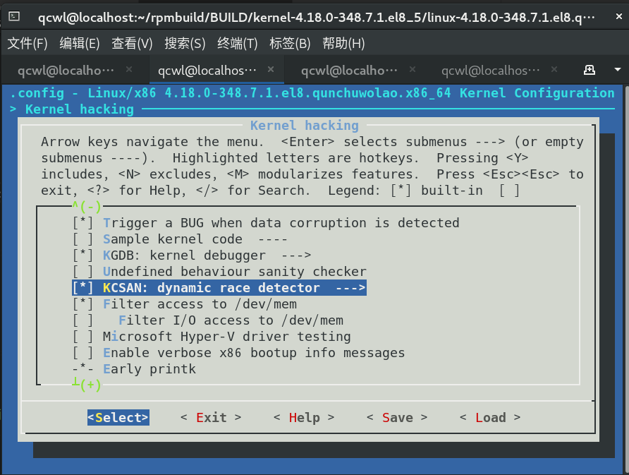
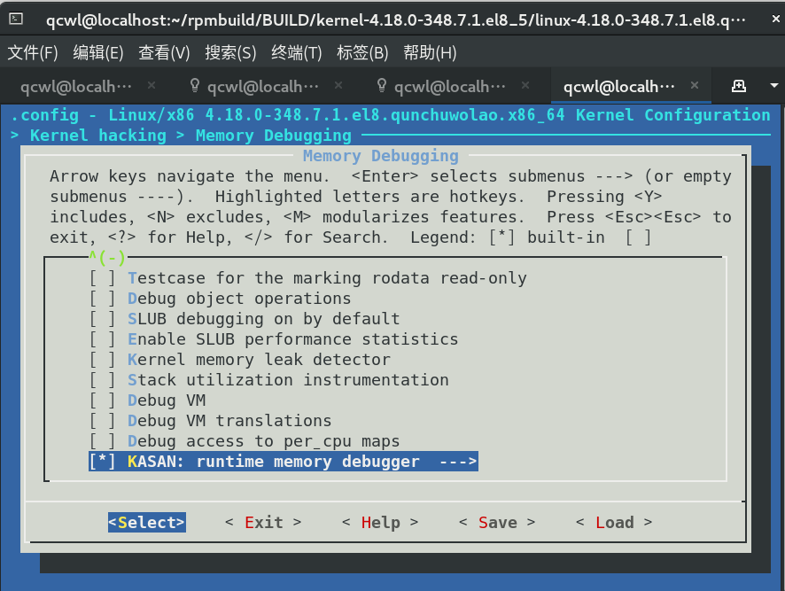
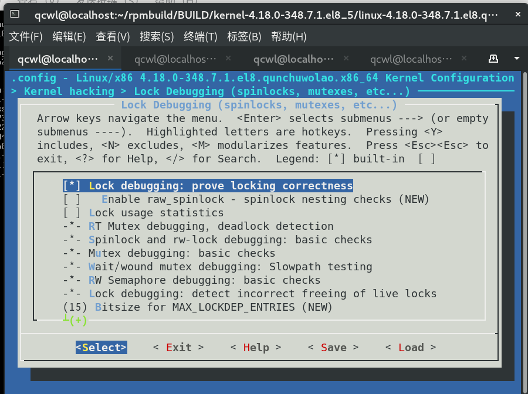
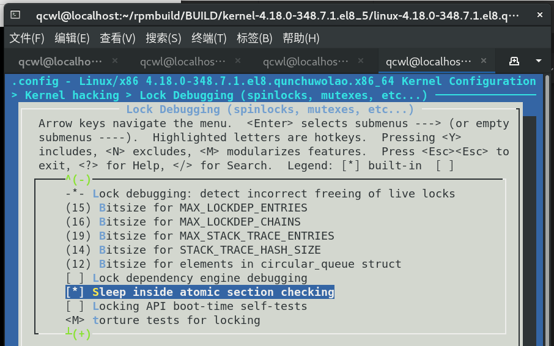

# 第 9 周

## 锁的探测

7 月 28 日下午，我们与马玉昆老师进行了会议交流。马老师表示，我们认为读写锁要使用独立探测点的观点是正确的，并鼓励我们多动手查资料。针对我提出的问题“不同进程申请同一锁时，是否应该记录时间，以判断是否发生冲突”，他表示我们的工具更多地是一种静态的分析，没有必要判断出是否发生冲突，因此记录时间不是特别必要，但应该能分析出进程是否持有相同的锁。我发现似乎一分钟就有上千个不同的自旋锁的获取，模块的内存占用只会越来越大，是否需要定期清理、删除一部分信息，马老师表示，一个进程申请多次同一把锁的话，只记录第一次的调用栈信息就行了，这样最终我们模块的内存消耗应该会有一个上限值。针对我提出的锁的地址问题，马老师认为，同一锁在不同进程中的地址是相同的。

## kernel 学习

上周只使用 gdb 追踪了[一部分有关自旋锁的情况](0722.md#自旋锁读写锁)，我们继续看一些其他情况。

### _raw_spin_lock_irq

```text
(gdb) hbreak _raw_spin_lock_irq
Hardware assisted breakpoint 2 at 0xffffffff819ac03b: file kernel/locking/spinlock.c, line 166.
(gdb) c
Continuing.

Thread 1 hit Breakpoint 2, _raw_spin_lock_irq (
    lock=lock@entry=0xffffffff830a9800 <ucounts_lock>)
    at kernel/locking/spinlock.c:166
166	{
(gdb) s
167		__raw_spin_lock_irq(lock);
(gdb) s
__raw_spin_lock_irq (lock=0xffffffff830a9800 <ucounts_lock>)
    at kernel/locking/spinlock.c:167
167		__raw_spin_lock_irq(lock);
(gdb) s
arch_irqs_disabled () at kernel/locking/spinlock.c:167
167		__raw_spin_lock_irq(lock);
(gdb) s
arch_local_save_flags () at ./arch/x86/include/asm/paravirt.h:789
789		return PVOP_CALLEE0(unsigned long, pv_irq_ops.save_fl);
(gdb) s
native_save_fl () at arch/x86/kernel/irqflags.S:11
11		pushf
(gdb) s
native_save_fl () at arch/x86/kernel/irqflags.S:12
12		pop %_ASM_AX
(gdb) s
native_save_fl () at arch/x86/kernel/irqflags.S:13
13		ret
(gdb) s
__raw_spin_lock_irq (lock=0xffffffff830a9800 <ucounts_lock>)
    at ./include/linux/spinlock_api_smp.h:126
126		local_irq_disable();
(gdb) s
arch_local_irq_disable () at ./arch/x86/include/asm/paravirt.h:799
799		PVOP_VCALLEE0(pv_irq_ops.irq_disable);
(gdb) s
native_irq_disable () at ./arch/x86/include/asm/irqflags.h:46
46		asm volatile("cli": : :"memory");
(gdb) s
__raw_spin_lock_irq (lock=0xffffffff830a9800 <ucounts_lock>)
    at ./include/linux/spinlock_api_smp.h:126
126		local_irq_disable();
(gdb) s
trace_hardirqs_off () at kernel/trace/trace_preemptirq.c:75
75	{
(gdb) s
78		if (!this_cpu_read(tracing_irq_cpu)) {
(gdb) s
79			this_cpu_write(tracing_irq_cpu, 1);
(gdb) s
81			if (!in_nmi())
(gdb) s
preempt_count () at ./arch/x86/include/asm/preempt.h:26
26		return raw_cpu_read_4(__preempt_count) & ~PREEMPT_NEED_RESCHED;
(gdb) s
82				trace_irq_disable_rcuidle(CALLER_ADDR0, CALLER_ADDR1);
(gdb) s
trace_irq_disable_rcuidle (parent_ip=0, ip=18446744071588986995)
    at kernel/trace/trace_preemptirq.c:82
82				trace_irq_disable_rcuidle(CALLER_ADDR0, CALLER_ADDR1);
(gdb) s
static_key_false (key=0xffffffff829e8688 <__tracepoint_irq_disable+8>)
    at kernel/trace/trace_preemptirq.c:82
82				trace_irq_disable_rcuidle(CALLER_ADDR0, CALLER_ADDR1);
(gdb) s
arch_static_branch (branch=false, 
    key=0xffffffff829e8688 <__tracepoint_irq_disable+8>)
    at ./arch/x86/include/asm/jump_label.h:38
38		asm_volatile_goto("1:"
(gdb) s
trace_hardirqs_off () at kernel/trace/trace_preemptirq.c:82
82				trace_irq_disable_rcuidle(CALLER_ADDR0, CALLER_ADDR1);
(gdb) s
trace_irq_disable_rcuidle (parent_ip=0, ip=18446744071588986995)
    at kernel/trace/trace_preemptirq.c:82
82				trace_irq_disable_rcuidle(CALLER_ADDR0, CALLER_ADDR1);
(gdb) s
static_key_false (key=<optimized out>) at kernel/trace/trace_preemptirq.c:82
82				trace_irq_disable_rcuidle(CALLER_ADDR0, CALLER_ADDR1);
(gdb) s
arch_static_branch (branch=<optimized out>, key=<optimized out>)
    at ./arch/x86/include/asm/jump_label.h:46
46		return false;
(gdb) s
__raw_spin_lock_irq (lock=0xffffffff830a9800 <ucounts_lock>)
    at ./include/linux/spinlock_api_smp.h:129
129		LOCK_CONTENDED(lock, do_raw_spin_trylock, do_raw_spin_lock);
(gdb) s
do_raw_spin_lock (lock=0xffffffff830a9800 <ucounts_lock>)
    at ./include/linux/spinlock_api_smp.h:129
129		LOCK_CONTENDED(lock, do_raw_spin_trylock, do_raw_spin_lock);
(gdb) s
queued_spin_lock (lock=0xffffffff830a9800 <ucounts_lock>)
    at ./include/linux/spinlock_api_smp.h:129
129		LOCK_CONTENDED(lock, do_raw_spin_trylock, do_raw_spin_lock);
(gdb) s
atomic_cmpxchg (new=1, old=0, v=0xffffffff830a9800 <ucounts_lock>)
    at ./include/linux/spinlock_api_smp.h:129
129		LOCK_CONTENDED(lock, do_raw_spin_trylock, do_raw_spin_lock);
(gdb) s
arch_atomic_cmpxchg (new=1, old=0, v=0xffffffff830a9800 <ucounts_lock>)
    at ./arch/x86/include/asm/atomic.h:192
192		return arch_cmpxchg(&v->counter, old, new);
(gdb) s
queued_spin_lock (lock=0xffffffff830a9800 <ucounts_lock>)
    at ./include/asm-generic/qspinlock.h:87
87		if (likely(val == 0))
(gdb) s
get_ucounts (ns=ns@entry=0xffffffff82850780 <init_user_ns>, uid=...)
    at kernel/ucount.c:152
152		ucounts = find_ucounts(ns, uid, hashent);
```

### _raw_spin_lock_bh

```text
(gdb) hbreak _raw_spin_lock_bh
Hardware ass    isted breakpoint 3 at 0xffffffff819abcdb: file kernel/locking/spinlock.c, line 174.
(gdb) delete breakpoints 2
(gdb) c
Continuing.

Thread 1 hit Breakpoint 3, _raw_spin_lock_bh (
    lock=lock@entry=0xffffffff831dc0bc <cgroup_idr_lock>)
    at kernel/locking/spinlock.c:174
174	{
(gdb) s
175		__raw_spin_lock_bh(lock);
(gdb) s
__raw_spin_lock_bh (lock=0xffffffff831dc0bc <cgroup_idr_lock>)
    at ./include/linux/spinlock_api_smp.h:134
134		__local_bh_disable_ip(_RET_IP_, SOFTIRQ_LOCK_OFFSET);
(gdb) s
__local_bh_disable_ip (ip=18446744071580480599, cnt=cnt@entry=512)
    at kernel/softirq.c:117
117	{
(gdb) s
120		WARN_ON_ONCE(in_irq());
(gdb) s
preempt_count () at ./arch/x86/include/asm/preempt.h:26
26		return raw_cpu_read_4(__preempt_count) & ~PREEMPT_NEED_RESCHED;
(gdb) s
__local_bh_disable_ip (ip=18446744071580480599, cnt=cnt@entry=512)
    at kernel/softirq.c:120
120		WARN_ON_ONCE(in_irq());
(gdb) s
122		raw_local_irq_save(flags);
(gdb) s
arch_local_irq_save () at kernel/softirq.c:122
122		raw_local_irq_save(flags);
(gdb) s
arch_local_save_flags () at ./arch/x86/include/asm/paravirt.h:811
811		f = arch_local_save_flags();
(gdb) s
native_save_fl () at arch/x86/kernel/irqflags.S:11
11		pushf
(gdb) s
native_save_fl () at arch/x86/kernel/irqflags.S:12
12		pop %_ASM_AX
(gdb) s
native_save_fl () at arch/x86/kernel/irqflags.S:13
13		ret
(gdb) s
arch_local_irq_save () at ./arch/x86/include/asm/paravirt.h:812
812		arch_local_irq_disable();
(gdb) s
arch_local_irq_disable () at ./arch/x86/include/asm/paravirt.h:812
812		arch_local_irq_disable();
(gdb) s
native_irq_disable () at ./arch/x86/include/asm/irqflags.h:46
46		asm volatile("cli": : :"memory");
(gdb) s
__local_bh_disable_ip (ip=<optimized out>, cnt=cnt@entry=512)
    at kernel/softirq.c:130
130		__preempt_count_add(cnt);
(gdb) s
__preempt_count_add (val=512) at ./arch/x86/include/asm/preempt.h:79
79		raw_cpu_add_4(__preempt_count, val);
(gdb) s
__local_bh_disable_ip (ip=<optimized out>, cnt=cnt@entry=512)
    at kernel/softirq.c:136
136		raw_local_irq_restore(flags);
(gdb) s
arch_local_irq_restore (f=838) at ./arch/x86/include/asm/paravirt.h:794
794		PVOP_VCALLEE1(pv_irq_ops.restore_fl, f);
(gdb) s
native_restore_fl (flags=838) at ./arch/x86/include/asm/irqflags.h:38
38		asm volatile("push %0 ; popf"
(gdb) s
__local_bh_disable_ip (ip=<optimized out>, cnt=cnt@entry=512)
    at kernel/softirq.c:142
142			trace_preempt_off(CALLER_ADDR0, get_lock_parent_ip());
(gdb) s
__raw_spin_lock_bh (lock=0xffffffff831dc0bc <cgroup_idr_lock>)
    at ./include/linux/spinlock_api_smp.h:136
136		LOCK_CONTENDED(lock, do_raw_spin_trylock, do_raw_spin_lock);
(gdb) s
do_raw_spin_lock (lock=0xffffffff831dc0bc <cgroup_idr_lock>)
    at ./include/linux/spinlock_api_smp.h:136
136		LOCK_CONTENDED(lock, do_raw_spin_trylock, do_raw_spin_lock);
(gdb) s
queued_spin_lock (lock=0xffffffff831dc0bc <cgroup_idr_lock>)
    at ./include/linux/spinlock_api_smp.h:136
136		LOCK_CONTENDED(lock, do_raw_spin_trylock, do_raw_spin_lock);
(gdb) s
atomic_cmpxchg (new=1, old=0, v=0xffffffff831dc0bc <cgroup_idr_lock>)
    at ./include/linux/spinlock_api_smp.h:136
136		LOCK_CONTENDED(lock, do_raw_spin_trylock, do_raw_spin_lock);
(gdb) s
arch_atomic_cmpxchg (new=1, old=0, v=0xffffffff831dc0bc <cgroup_idr_lock>)
    at ./arch/x86/include/asm/atomic.h:192
192		return arch_cmpxchg(&v->counter, old, new);
(gdb) s
queued_spin_lock (lock=0xffffffff831dc0bc <cgroup_idr_lock>)
    at ./include/asm-generic/qspinlock.h:87
87		if (likely(val == 0))
(gdb) s
cgroup_idr_alloc (idr=idr@entry=0xffffffff828b7310 <cpuset_cgrp_subsys+176>, 
    ptr=ptr@entry=0xffffffff828b8700 <top_cpuset>, start=start@entry=1, 
    end=end@entry=2, gfp_mask=gfp_mask@entry=6291648)
    at kernel/cgroup/cgroup.c:303
303		ret = idr_alloc(idr, ptr, start, end, gfp_mask & ~__GFP_DIRECT_RECLAIM);
```

### _raw_spin_trylock

```text
(gdb) delete breakpoints 4
(gdb) hbreak _raw_spin_trylock
Hardware assisted breakpoint 5 at 0xffffffff819abc50: file kernel/locking/spinlock.c, line 134.
(gdb) c
Continuing.

Thread 1 hit Breakpoint 5, _raw_spin_trylock (
    lock=lock@entry=0xffffffff83b37f40 <printing_lock>)
    at kernel/locking/spinlock.c:134
134	{
(gdb) s
135		return __raw_spin_trylock(lock);
(gdb) s
__raw_spin_trylock (lock=lock@entry=0xffffffff83b37f40 <printing_lock>)
    at kernel/locking/spinlock.c:135
135		return __raw_spin_trylock(lock);
(gdb) s
do_raw_spin_trylock (lock=0xffffffff83b37f40 <printing_lock>)
    at kernel/locking/spinlock.c:135
135		return __raw_spin_trylock(lock);
(gdb) s
queued_spin_trylock (lock=0xffffffff83b37f40 <printing_lock>)
    at kernel/locking/spinlock.c:135
135		return __raw_spin_trylock(lock);
(gdb) s
atomic_read (v=0xffffffff83b37f40 <printing_lock>)
    at kernel/locking/spinlock.c:135
135		return __raw_spin_trylock(lock);
(gdb) s
arch_atomic_read (v=0xffffffff83b37f40 <printing_lock>)
    at kernel/locking/spinlock.c:135
135		return __raw_spin_trylock(lock);
(gdb) s
__read_once_size (size=4, res=<synthetic pointer>, 
    p=0xffffffff83b37f40 <printing_lock>) at ./include/linux/compiler.h:276
276		__READ_ONCE_SIZE;
(gdb) s
queued_spin_trylock (lock=0xffffffff83b37f40 <printing_lock>)
    at ./arch/x86/include/asm/atomic.h:29
29		return READ_ONCE((v)->counter);
(gdb) s
71		   (atomic_cmpxchg_acquire(&lock->val, 0, _Q_LOCKED_VAL) == 0))
(gdb) s
atomic_cmpxchg (new=1, old=0, v=0xffffffff83b37f40 <printing_lock>)
    at ./include/asm-generic/qspinlock.h:71
71		   (atomic_cmpxchg_acquire(&lock->val, 0, _Q_LOCKED_VAL) == 0))
(gdb) s
arch_atomic_cmpxchg (new=1, old=0, v=0xffffffff83b37f40 <printing_lock>)
    at ./arch/x86/include/asm/atomic.h:192
192		return arch_cmpxchg(&v->counter, old, new);
(gdb) s
vt_console_print (co=<optimized out>, 
    b=0xffffffff830afa20 <text> "[    0.001000] x86/cpu: User Mode Instruction Prevention (UMIP) activated\nbytes, vmalloc)\n\n6)\n_idle_ns: 440795242287 ns\nss, 405916K reserved, 0K cma-reserved)\ninux 8 at https://catalog.redhat.com.\n=vg"..., count=74) at drivers/tty/vt/vt.c:2780
```

### raw_spin_trylock_irq

```c
#define raw_spin_trylock_irq(lock) \
({ \
	local_irq_disable(); \
	raw_spin_trylock(lock) ? \
	1 : ({ local_irq_enable(); 0;  }); \
})
```

### raw_spin_trylock_irqsave

```c
#define raw_spin_trylock_irqsave(lock, flags) \
({ \
	local_irq_save(flags); \
	raw_spin_trylock(lock) ? \
	1 : ({ local_irq_restore(flags); 0; }); \
})
```

以上两个宏最后都会调用 `raw_spin_trylock`，但其他几种情况即 _raw_spin_lock_bh、_raw_spin_lock_irq、_raw_spin_lock_irqsave、_raw_spin_trylock 都需要追踪，其中 _raw_spin_trylock 情况似乎更加复杂（涉及到是否尝试加锁成功），我们先搁置它。

## 内核模块开发 

### KProbe 问题

我曾经认为，KProbe 会自动[关抢占和中断](0604.md#采用的追踪技术对并发的处理)，但却发现在开发中常常遇到死锁。经过重新查找[资料](https://lishiwen4.github.io/linux-kernel/linu-kprobe)，我发现在 SMP 上 KProbe 不会像我想象的那样串行化，而是“多个探测点处理函数或同一处理函数的多个实例能够在不同的 CPU 上同时运行。”针对有关的问题，我希望用 Linux 的一些调试相关的编译选项来尝试。

我打开 [KCSAN](https://pan.educg.net/api/v3/file/get/3866/KCSAN-Linux%E5%86%85%E6%A0%B8%E6%95%B0%E6%8D%AE%E7%AB%9E%E6%80%81%E6%8E%A2%E6%B5%8B%E5%99%A8%282%29-%E5%88%98%E6%AD%A3%E5%85%83.pdf?sign=vSi75kR1miGJudzGBflpV1SPcE7FHVeD0469GNNHo5E%3D%3A0)，看了一阵子，却没发现问题在哪。


接着，我启用 [KASAN](https://cloud.tencent.com/developer/article/1518011) 和 [Lockdep](http://kernel.meizu.com/linux-dead-lock-detect-lockdep.html)。




编译时却出现：
```text
include/linux/mm_types.h:576: seqcount_t write_protect_seq is larger than unsigned long rh_reserved3. Disable CONFIG_RH_KABI_SIZE_ALIGN_CHECKS if debugging.
```
把 `CONFIG_RH_KABI_SIZE_ALIGN_CHECKS` 选项关掉后，编译，使用新内核启动，终于发现有这样的输出：
```text
[   94.672481] ================================
[   94.674330] WARNING: inconsistent lock state
[   94.676280] 4.18.0-348.7.1.el8.qunchuwolao.x86_64 #1 Tainted: G           OE    ---------r-  -
[   94.681341] --------------------------------
[   94.684226] inconsistent {IN-HARDIRQ-W} -> {HARDIRQ-ON-W} usage.
[   94.687553] swapper/3/0 [HC0[0]:SC1[1]:HE1:SE0] takes:
[   94.690554] ffffffffa0b5aed8 (&table_lock){?.-.}-{2:2}, at: pre_handler_spin_lock_irqsave+0x7a/0xc7 [lock_test]
[   94.695917] {IN-HARDIRQ-W} state was registered at:
[   94.699077]   __lock_acquire+0x48a/0x80a
[   94.701277]   lock_acquire+0x1b1/0x30b
[   94.703308]   _raw_spin_lock+0x38/0x46
[   94.705371]   pre_handler_spin_lock_irqsave+0x7a/0xc7 [lock_test]
[   94.708575]   kprobe_ftrace_handler+0xbd/0x143
[   94.710975]   ftrace_ops_list_func+0xfa/0x182
[   94.713366]   ftrace_regs_call+0x5/0xd3
[   94.715020]   _raw_spin_lock_irqsave+0x5/0x68
[   94.716880]   hrtimer_interrupt+0x6e/0x34d
[   94.718632]   local_apic_timer_interrupt+0x3d/0x5c
[   94.721887]   smp_apic_timer_interrupt+0xe1/0x23d
[   94.724428]   apic_timer_interrupt+0xf/0x20
[   94.726924]   ftrace_get_addr_curr+0x15/0xac
[   94.729685]   add_breakpoints+0xe/0x4a
[   94.731651]   ftrace_replace_code+0x33/0x156
[   94.734024]   ftrace_modify_all_code+0x84/0xc8
[   94.736374]   arch_ftrace_update_code+0x22/0x3c
[   94.738659]   ftrace_run_update_code+0x13/0x30
[   94.740919]   ftrace_startup_enable+0x28/0x2f
[   94.743322]   ftrace_startup+0x7d/0xb3
[   94.745275]   register_ftrace_function+0x35/0x85
[   94.748111]   __arm_kprobe_ftrace+0x99/0xe0
[   94.750509]   arm_kprobe_ftrace+0x43/0x45
[   94.752670]   arm_kprobe+0x57/0x5b
[   94.754508]   register_kprobe+0x295/0x310
[   94.756733]   register_kprobes+0x2f/0x66
[   94.758948]   start_module+0xa9/0x1000 [lock_test]
[   94.763396]   do_one_initcall+0x103/0x337
[   94.767621]   do_init_module+0xa2/0x319
[   94.771915]   load_module+0x5af/0x607
[   94.775982]   __do_sys_finit_module+0x17b/0x193
[   94.780675]   __se_sys_finit_module+0xa/0xb
[   94.784804]   __x64_sys_finit_module+0x3e/0x43
[   94.789191]   do_syscall_64+0xa0/0x2b5
[   94.793005]   entry_SYSCALL_64_after_hwframe+0x6a/0xdf
[   94.798510] irq event stamp: 389052
[   94.802346] hardirqs last  enabled at (389052): [<ffffffff81002d5a>] trace_hardirqs_on_thunk+0x1a/0x20
[   94.809258] hardirqs last disabled at (389051): [<ffffffff81002d7a>] trace_hardirqs_off_thunk+0x1a/0x20
[   94.816045] softirqs last  enabled at (389048): [<ffffffff811358df>] _local_bh_enable+0x1d/0x22
[   94.822653] softirqs last disabled at (389049): [<ffffffff81136211>] irq_exit+0xbb/0x118
[   94.828817] 
[   94.828817] other info that might help us debug this:
[   94.837872]  Possible unsafe locking scenario:
[   94.837872] 
[   94.844719]        CPU0
[   94.847774]        ----
[   94.850891]   lock(&table_lock);
[   94.854360]   <Interrupt>
[   94.857357]     lock(&table_lock);
[   94.860490] 
[   94.860490]  *** DEADLOCK ***
[   94.860490] 
[   94.868665] no locks held by swapper/3/0.
[   94.872377] 
[   94.872377] stack backtrace:
[   94.877853] CPU: 3 PID: 0 Comm: swapper/3 Tainted: G           OE    ---------r-  - 4.18.0-348.7.1.el8.qunchuwolao.x86_64 #1
[   94.885547] Hardware name: Red Hat KVM, BIOS 1.13.0-2.module_el8.5.0+746+bbd5d70c 04/01/2014
[   94.891651] Call Trace:
[   94.894598]  <IRQ>
[   94.897462]  ? __dump_stack+0x1b/0x1c
[   94.901493]  ? dump_stack+0x84/0xc7
[   94.905286]  ? print_usage_bug+0x1c8/0x1d1
[   94.909142]  ? mark_lock_irq+0x18c/0x302
[   94.912999]  ? mark_lock+0x1f4/0x271
[   94.916698]  ? mark_usage+0x16b/0x1a9
[   94.920482]  ? __lock_acquire+0x48a/0x80a
[   94.924485]  ? _raw_spin_lock_irqsave+0x5/0x68
[   94.928369]  ? lock_acquire+0x1b1/0x30b
[   94.932057]  ? pre_handler_spin_lock_irqsave+0x7a/0xc7 [lock_test]
[   94.937067]  ? rcu_read_unlock+0x57/0x57
[   94.940925]  ? _raw_write_lock_irqsave+0x68/0x68
[   94.945071]  ? mark_held_locks+0x1f/0xa7
[   94.948888]  ? trace_hardirqs_on_thunk+0x1a/0x20
[   94.954163]  ? _raw_spin_lock_irqsave+0x5/0x68
[   94.958385]  ? _raw_spin_lock+0x38/0x46
[   94.962234]  ? pre_handler_spin_lock_irqsave+0x7a/0xc7 [lock_test]
[   94.967147]  ? pre_handler_spin_lock_irqsave+0x7a/0xc7 [lock_test]
[   94.971952]  ? _raw_spin_lock_irqsave+0x1/0x68
[   94.976042]  ? kprobe_ftrace_handler+0xbd/0x143
[   94.980149]  ? _raw_write_lock_irqsave+0x68/0x68
[   94.984354]  ? update_blocked_averages+0x90/0x27a
[   94.988462]  ? ftrace_ops_list_func+0xfa/0x182
[   94.992892]  ? ftrace_regs_call+0x5/0xd3
[   94.996606]  ? update_blocked_averages+0x80/0x27a
[   95.000702]  ? _raw_spin_lock_irqsave+0x1/0x68
[   95.004765]  ? _raw_spin_lock_irqsave+0x5/0x68
[   95.008636]  ? update_blocked_averages+0x90/0x27a
[   95.012572]  ? __update_blocked_fair+0x76e/0x76e
[   95.017016]  ? __kasan_check_read+0x10/0x11
[   95.021592]  ? run_rebalance_domains+0x59/0x65
[   95.025460]  ? __do_softirq+0x184/0x4fb
[   95.028990]  ? kvm_sched_clock_read+0x5/0xd
[   95.032716]  ? irq_exit+0xbb/0x118
[   95.036143]  ? smp_apic_timer_interrupt+0x1d1/0x23d
[   95.040946]  ? apic_timer_interrupt+0xf/0x20
[   95.044797]  </IRQ>
[   95.047611]  ? lockdep_hardirqs_on+0x116/0x198
[   95.051603]  ? native_safe_halt+0xe/0xf
[   95.055039]  ? default_idle+0xf/0x12
[   95.058598]  ? arch_cpu_idle+0x11/0x12
[   95.062123]  ? default_idle_call+0xd9/0x242
[   95.065980]  ? cpuidle_idle_call+0x159/0x1df
[   95.069696]  ? arch_cpu_idle_exit+0x28/0x28
[   95.073465]  ? __asan_loadN+0xe/0xf
[   95.076717]  ? tsc_verify_tsc_adjust+0x70/0x125
[   95.080756]  ? do_idle+0xdf/0x12c
[   95.084953]  ? cpu_startup_entry+0xc2/0xc4
[   95.088580]  ? cpu_in_idle+0x24/0x24
[   95.091947]  ? clockevents_config_and_register+0x4e/0x55
[   95.096136]  ? start_secondary+0x18f/0x1c0
[   95.099829]  ? smp_callin+0x1ab/0x1ab
[   95.103278]  ? start_cpu0+0xc/0xc
[   95.106395]  ? secondary_startup_64_no_verify+0xc2/0xcb
```

原来 KProbe 运行时并不会关中断？带着这样的疑问，我编写了一段程序加以测试，结果证明，确实有时 KProbe 运行时本地中断未被禁止：
